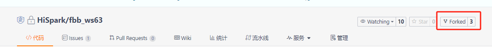
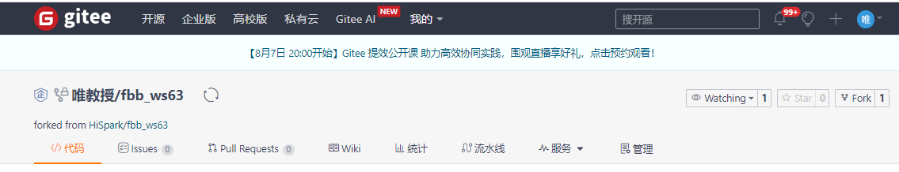
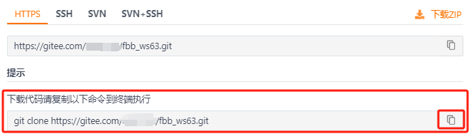
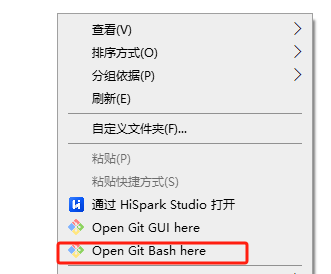
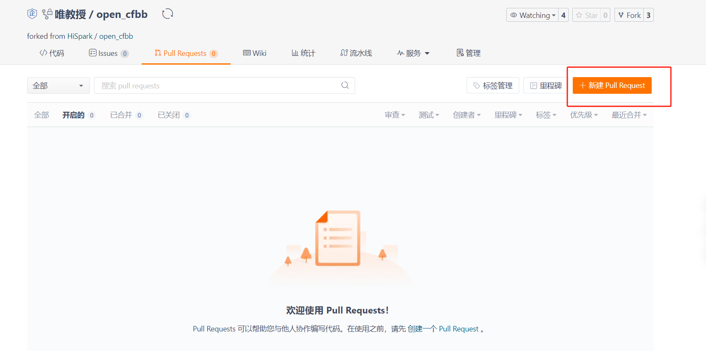
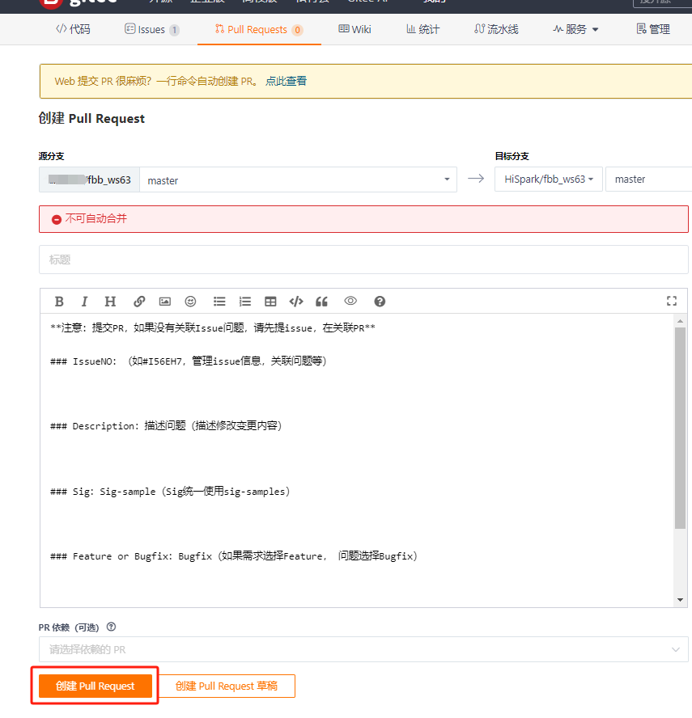
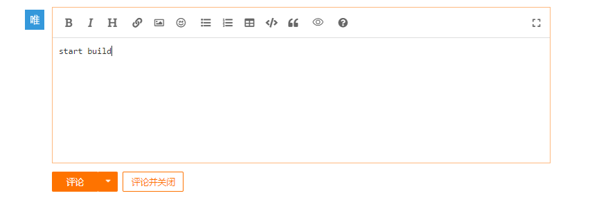

# fbb_ws63开发指南

## 介绍

  fbb_ws63代码仓为支持ws63和ws63e解决方案SDK，该SDK包从统一开发平台FBB（Family Big Box，统一开发框架，统一API）构建而来，在该平台上开发的应用很容易被移植到其他星闪解决方案上，有效降低开发者门槛，缩短开发周期，支持开发者快速开发星闪产品。

## 支持的开发板

| 开发板名称                  | 硬件资料                                                     | 软件资料     | 购买链接                                                     |
| --------------------------- | ------------------------------------------------------------ | ------------ | ------------------------------------------------------------ |
| HiHope_NearLink_DK3863E_V03 | [扩展板硬件资料](https://gitee.com/HiSpark/fbb_ws63/tree/master/docs/hardware/HiHope_NearLink_DK_WS63E_V03) | 参考示例教程 | [开发板购买链接](https://main.m.taobao.com/security-h5-detail/home?id=808369265492&spm=a2141.7631565.tbshopmod-guess_your_like.808369265492&scm=1007.18373.317678.0&pvid=fdb854bd-99a3-4b65-955b-392bdf0c083e&fromNormal=true) |

## 目录介绍

| 目录   | 介绍                                                         |
| ------ | ------------------------------------------------------------ |
| docs   | 存放芯片手册、IO复用关系表、HiHope_NearLink_DK3863E_V03硬件原理图 |
| src    | SDK源码目录                                                  |
| tools  | 开发工具及环境搭建指南                                       |
| vendor | 存放对应开发板案例                                           |

## 示例教程

HiHope_NearLink_DK3863E_V03提供了以下Demo供开发参考：

<table  width="990" border="0" cellpadding="0" cellspacing="0" style='border-collapse:collapse;table-layout:fixed;'>
 <tr height="18" style='height:13.50pt;'>
  <td width="140" x:str><strong>一级分类</strong></td>
  <td width="170" x:str><strong>子分类</strong></td>
  <td width="680" colspan="6" align="center" x:str><strong>应用示例</strong></td>
 </tr>
 <tr height="18" style='height:13.50pt;'>
  <td width="140" align="center" rowspan="5" style='height:27.00pt' x:str>
<strong>基础驱动</strong></td>
  <td x:str><strong>I2C</strong></td>
  <td width="170" x:str><a href="https://gitee.com/HiSpark/fbb_ws63/tree/master/src/application/samples/peripheral/i2c">I2C组件master端案例</a></td>
  <td width="170" x:str><a href="https://gitee.com/HiSpark/fbb_ws63/tree/master/src/application/samples/peripheral/i2c">I2C组件slave端案例</a></td>
  <td width="170" x:str><a href="https://gitee.com/HiSpark/fbb_ws63/tree/master/vendor/HiHope_NearLink_DK_WS63E_V03/demo/oled">SSD1306 OLED屏幕显示“Hello World”</a></td>
  <td width="170" x:str><a href="https://gitee.com/HiSpark/fbb_ws63/tree/master/vendor/HiHope_NearLink_DK_WS63E_V03/demo/environment">AHT20模块读取当前温湿度并显示在屏幕案例</a></td>
  <td width="170" x:str><a href=""></a></td>
  <td width="170" x:str><a href=""></a></td>
 </tr>
 <tr height="18" style='height:13.50pt;'>
  <td x:str><strong>SPI</strong></td>
  <td x:str><a href="https://gitee.com/HiSpark/fbb_ws63/tree/master/src/application/samples/peripheral/spi">SPI组件master端案例</a></td>
  <td x:str><a href="https://gitee.com/HiSpark/fbb_ws63/tree/master/src/application/samples/peripheral/spi">SPI组件slave端案例</a></td>
  <td x:str><a href="https://gitee.com/HiSpark/fbb_ws63/tree/master/vendor/HiHope_NearLink_DK_WS63E_V03/demo/gyro">LSM6DSM模块读取横滚角、俯仰角、偏航角</a></td>
  <td width="170" x:str><a href=""></a></td>
  <td ></td>
  <td ></td>
 </tr>
 <tr height="18" style='height:13.50pt;'>
  <td x:str><strong>UART</strong></td>
  <td x:str><a href="https://gitee.com/HiSpark/fbb_ws63/tree/master/src/application/samples/peripheral/uart">UART轮询案例</a></td>
  <td x:str><a href="https://gitee.com/HiSpark/fbb_ws63/tree/master/src/application/samples/peripheral/uart">UART中断读取案例</a></td>
  <td x:str><a href="https://gitee.com/HiSpark/fbb_ws63/tree/master/vendor/HiHope_NearLink_DK_WS63E_V03/demo/uartdemo">开发板UART自发自收</a></td>
  <td width="170" x:str><a href=""></a></td>
  <td ></td>
  <td ></td>
 </tr>
 <tr height="18" style='height:13.50pt;'>
  <td x:str><strong>PWM</strong></td>
  <td x:str><a href="https://gitee.com/HiSpark/fbb_ws63/tree/master/src/application/samples/peripheral/pwm">PWM案例</a></td>
  <td x:str><a href="https://gitee.com/HiSpark/fbb_ws63/tree/master/vendor/HiHope_NearLink_DK_WS63E_V03/demo/beep">蜂鸣器案例</a></td>
  <td width="170" x:str><a href=""></a></td>
  <td width="170" x:str><a href=""></a></td>
  <td ></td>
  <td ></td>
 </tr>
 <tr height="18" style='height:13.50pt;'>
  <td x:str><strong>GPIO</strong></td>
  <td x:str><a href="https://gitee.com/HiSpark/fbb_ws63/tree/master/vendor/HiHope_NearLink_DK_WS63E_V03/demo/buttondemo">按键案例</a></td>
  <td x:str><a href="https://gitee.com/HiSpark/fbb_ws63/tree/master/vendor/HiHope_NearLink_DK_WS63E_V03/demo/led">点亮LED灯案例</a></td>
  <td x:str><a href="https://gitee.com/HiSpark/fbb_ws63/tree/master/vendor/HiHope_NearLink_DK_WS63E_V03/demo/servo">实现SG92R舵机转动-90°、-45°、0°、45°、90°</a></td>
  <td x:str><a href="https://gitee.com/HiSpark/fbb_ws63/tree/master/vendor/HiHope_NearLink_DK_WS63E_V03/demo/tricolored">实现SK6812三色灯亮绿、红、蓝三种颜色</a></td>
  <td x:str><a href="https://gitee.com/HiSpark/fbb_ws63/tree/master/vendor/HiHope_NearLink_DK_WS63E_V03/demo/ultrasonic">超声波测距</a></td>
  <td x:str><a href="https://gitee.com/HiSpark/fbb_ws63/tree/master/vendor/HiHope_NearLink_DK_WS63E_V03/demo/trafficlight">交通灯案例</a></td>
 </tr>
  <tr height="18" style='height:13.50pt;'>
  <td width="140" align="center" rowspan="5" style='height:27.00pt' x:str>
<strong>操作系统</strong></td>
  <td x:str><strong>Thread</strong></td>
  <td width="170" x:str><a href="https://gitee.com/HiSpark/fbb_ws63/tree/master/vendor/HiHope_NearLink_DK_WS63E_V03/demo/thread">线程使用案例</a></td>
  <td width="170" x:str><a href=""></a></td>
  <td width="170" x:str><a href=""></a></td>
  <td ></td>
  <td ></td>
  <td ></td>
 </tr>
 <tr height="18" style='height:13.50pt;'>
  <td x:str><strong>semaphore</strong></td>
  <td x:str><a href="https://gitee.com/HiSpark/fbb_ws63/tree/master/vendor/HiHope_NearLink_DK_WS63E_V03/demo/semaphore">信号量使用案例</a></td>
  <td width="170" x:str><a href=""></a></td>
  <td width="170" x:str><a href=""></a></td>
  <td ></td>
  <td ></td>
  <td ></td>
 </tr>
  <tr height="18" style='height:13.50pt;'>
  <td x:str><strong>event</strong></td>
  <td x:str><a href="https://gitee.com/HiSpark/fbb_ws63/tree/master/vendor/HiHope_NearLink_DK_WS63E_V03/demo/event">事件使用案例</a></td>
  <td width="170" x:str><a href=""></a></td>
  <td width="170" x:str><a href=""></a></td>
  <td ></td>
  <td ></td>
  <td ></td>
 </tr>
  <tr height="18" style='height:13.50pt;'>
  <td x:str><strong>message</strong></td>
  <td x:str><a href="https://gitee.com/HiSpark/fbb_ws63/tree/master/vendor/HiHope_NearLink_DK_WS63E_V03/demo/message">消息队列使用案例</a></td>
  <td width="170" x:str><a href=""></a></td>
  <td width="170" x:str><a href=""></a></td>
  <td ></td>
  <td ></td>
  <td ></td>
 </tr>
  <tr height="18" style='height:13.50pt;'>
  <td x:str><strong>mutex</strong></td>
  <td x:str><a href="https://gitee.com/HiSpark/fbb_ws63/tree/master/vendor/HiHope_NearLink_DK_WS63E_V03/demo/mutex">互斥锁使用案例</a></td>
  <td width="170" x:str><a href=""></a></td>
  <td width="170" x:str><a href=""></a></td>
  <td ></td>
  <td ></td>
  <td ></td>
 </tr>
  <tr height="18" style='height:13.50pt;'>
  <td width="140" align="center" rowspan="1" style='height:27.00pt' x:str>
<strong>星闪</strong></td>
  <td x:str><strong>SLE</strong></td>
  <td width="170" x:str><a href="https://gitee.com/HiSpark/fbb_ws63/tree/master/vendor/HiHope_NearLink_DK_WS63E_V03/demo/sle_distribute_network">SLE配网</a></td>
  <td width="170" x:str><a href="https://gitee.com/HiSpark/fbb_ws63/tree/master/vendor/HiHope_NearLink_DK_WS63E_V03/demo/sle_led">通过SLE控制LED灯</a></td>
  <td width="170" x:str><a href="https://gitee.com/HiSpark/fbb_ws63/tree/master/vendor/HiHope_NearLink_DK_WS63E_V03/demo/sle_wifi_coexist">WiFi/SLE共存</a></td>
  <td width="170" x:str><a href=""></a></td>
  <td width="170" x:str><a href=""></a></td>
  <td width="170" x:str><a href=""></a></td>
 </tr>
  <tr height="18" style='height:13.50pt;'>
  <td width="140" align="center" rowspan="1" style='height:27.00pt' x:str>
<strong>BLE</strong></td>
  <td x:str><strong>BLE</strong></td>
  <td width="170" x:str><a href=""></a></td>
  <td width="170" x:str><a href=""></a></td>
  <td width="170" x:str><a href=""></a></td>
  <td width="170" x:str><a href=""></a></td>
  <td width="170" x:str><a href=""></a></td>
  <td width="170" x:str><a href=""></a></td>
 </tr>
  <tr height="18" style='height:13.50pt;'>
  <td width="140" align="center" rowspan="1" style='height:27.00pt' x:str>
<strong>Wi-Fi</strong></td>
  <td x:str><strong>Wi-Fi</strong></td>
  <td width="170" x:str><a href="https://gitee.com/HiSpark/fbb_ws63/tree/master/vendor/HiHope_NearLink_DK_WS63E_V03/demo/wifista">Wi-Fi STA</a></td>
  <td width="170" x:str><a href="https://gitee.com/HiSpark/fbb_ws63/tree/master/vendor/HiHope_NearLink_DK_WS63E_V03/demo/wifiap">Wi-Fi AP</a></td>
  <td width="170" x:str><a href="https://gitee.com/HiSpark/fbb_ws63/tree/master/vendor/HiHope_NearLink_DK_WS63E_V03/demo/wifidemo">Wi-Fi TCP/UDP测速</a></td>
  <td width="170" x:str><a href=""></a></td>
  <td width="170" x:str><a href=""></a></td>
  <td width="170" x:str><a href=""></a></td>
 </tr>
 <tr height="18" style='height:13.50pt;'>
  <td width="140" align="center" rowspan="1" style='height:27.00pt' x:str>
<strong>TIMER</strong></td>
  <td x:str><strong>定时器</strong></td>
  <td x:str><a href="https://gitee.com/HiSpark/fbb_ws63/tree/master/vendor/HiHope_NearLink_DK_WS63E_V03/demo/timer">定时器</a></td>
  <td width="170" x:str><a href=""></a></td>
  <td width="170" x:str><a href=""></a></td>
  <td ></td>
  <td ></td>
  <td ></td>
 </tr>
 <tr height="18" style='height:13.50pt;'>
  <td width="140" align="center" rowspan="1" style='height:27.00pt' x:str>
<strong>雷达</strong></td>
  <td x:str><strong>运动感知</strong></td>
  <td x:str><a href="https://gitee.com/HiSpark/fbb_ws63/tree/master/vendor/HiHope_NearLink_DK_WS63E_V03/demo/radar_led">运动感知1.0</a></td>
  <td width="170" x:str><a href=""></a></td>
  <td width="170" x:str><a href=""></a></td>
  <td ></td>
  <td ></td>
  <td ></td>
 </tr>
 <tr height="18" style='height:13.50pt;'>
  <td width="140" align="center" rowspan="1" style='height:27.00pt' x:str>
<strong>低功耗</strong></td>
  <td x:str><strong>低功耗</strong></td>
  <td width="170" x:str><a href=""></a></td>
  <td x:str><a href=""></a></td>
  <td width="170" x:str><a href=""></a></td>
  <td ></td>
  <td ></td>
  <td ></td>
 </tr>
 <tr height="18" style='height:13.50pt;'>
  <td width="140" align="center" rowspan="4" style='height:27.00pt' x:str>
<strong>行业解决方案</strong></td>
  <td x:str><strong>鼠标</strong></td>
  <td width="170" x:str><a href=""></a></td>
  <td width="170" x:str><a href=""></a></td>
  <td width="170" x:str><a href=""></a></td>
  <td width="170" x:str><a href=""></a></td>
  <td width="170" x:str><a href=""></a></td>
  <td width="170" x:str><a href=""></a></td>
 </tr>
 <tr height="18" style='height:13.50pt;'>
  <td x:str><strong>键盘</strong></td>
  <td x:str><a href=""></a></td>
  <td width="170" x:str><a href=""></a></td>
  <td width="170" x:str><a href=""></a></td>
  <td ></td>
  <td ></td>
  <td ></td>
 </tr>
 <tr height="18" style='height:13.50pt;'>
  <td x:str><strong>车钥匙</strong></td>
  <td x:str><a href=""></a></td>
  <td width="170" x:str><a href=""></a></td>
  <td width="170" x:str><a href=""></a></td>
  <td ></td>
  <td ></td>
  <td ></td>
 </tr>
 <tr height="18" style='height:13.50pt;'>
  <td x:str><strong>遥控器</strong></td>
  <td x:str><a href=""></a></td>
  <td width="170" x:str><a href=""></a></td>
  <td width="170" x:str><a href=""></a></td>
  <td ></td>
  <td ></td>
  <td ></td>
 </tr>
 </tr>
 <tr>
<![if supportMisalignedColumns]>
   <tr height="18" style="display:none;">
   </tr>
  <![endif]>
</table>


## 参与贡献

- 在windows/linux下安装git，并配置git账号、密码、邮箱等

  git config --global user.name "Your Name" // 配置用户名

  git config --global user.email "your.email@example.com" // 配置邮箱

  git config –local user.password “xxxxx密码”  // 配置密码

  git config –list    // 查看配置信息

- fork仓库，就是把官方仓库当前时间点内容搬迁到自己账号下面，直接在网页上操作即可完成。如我们活动仓库Fork到自己账号下面。

  

- fork之后，在我们的gitee账号就可以看到这个仓库啦。

  

- 克隆到本地仓库，在windows/linux下打开git，点击网页上的“克隆/下载”，在本地文件夹中鼠标“右键”，选择"Open Git Bash here"，在打开的bash窗口，执行如下指令
  
  ```
   git clone https://gitee.com/xxxx/fbb_ws63.git   // xxx代表gitee账号
  ```
  
  
  
  
  
  
  
  
  
- 本地案例提交时，如果是厂家，则需要在vendor目录下创建自家开发板目录，目录命名规则：vendor/开发板名称/demo(存放对应开发板案例)、vendor/开发板名称/doc（存放开发板说明文档及原理图）、vendor/开发板名称/build_config.json；如果是个人开发者，则需要在vendor目录下创建others目录，目录命名规则：vendor/others/demo(存放对应开发板案例)、vendor/others/build_config.json，将案例指导文档存放在自己提交案例目录里

- 案例提交后，需要在build_config.json文件中添加对应的字段，字段描述及举例如下

  ```
   {
      "buildTarget": "ws63-liteos-app",  // 编译使用的target
      "relativePath": "demo/sle_throughput", // 编译案例路径
      "chip": "WS63",                         // 使用的芯片
      "buildDef": "CONFIG_SAMPLE_SUPPORT_SLE_SERVER_SPEED = y,SLE_SERVER_LED = 1",  // 如果是cmakelist中使用的宏，则写成xxx=y,当一个cmakelsit文件控制多个案例编译时，需要单独在build_condig.json文件中添加，如果是代码中使用的宏，则写成zzz=1，camkelist文件中与代码中都用到宏控制，则中间用‘,’号隔开
      "needSmoke": "false" // 是否冒烟
    },
    {
      "buildTarget": "ws63-liteos-app",
      "relativePath": "demo/sle_throughput",
      "chip": "WS63",
      "buildDef": "CONFIG_SAMPLE_SUPPORT_SLE_CLIENT_SPEED = y",
      "needSmoke": "false"
    }
  ```

- 修改完成后，在本地仓库修改要上传的内容，并通过git指令进行提交、推送。

  ```
  git status  // 查看修改变更后的文件
  git add *   // 将变更文件加入到暂存区
  git commit -s -m  "xxxxx" //将暂存区内容签名并提交到本地
  git push origin master // 推送本地修改到账号仓库
  ```

- [创建ISSUE](https://gitee.com/HiSpark/fbb_ws63/issues)，根据提示填写对应信息。

  

- 开始提交PR到官方仓库，在“Pull Requests”页面，点击“新建 Pull Request”，根据末班补充相关内容，点击“创建 Pull ”，在新弹出来界面评论区输入“start build”指令执行CI扫描，（Issuno为上步骤创建的issuno）

  

  

  

- 等待扫描，根据扫描结果解决所有问题后，联系管理员合入官方仓库。
