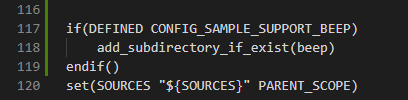
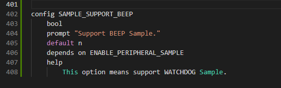
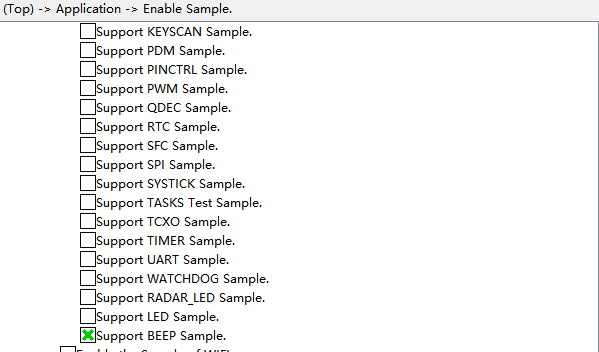

# beep

## 1.1 介绍

**功能介绍：** 使用PWM控制蜂鸣器鸣响。

**软件概述：** PWM是脉冲宽度调制缩写，通过调节占空比的变化来调节信号、能量等的变化，占空比就是指在一个周期内，信号处于高电平的时间占据整个信号周期的百分比。

**硬件概述：** 核心板、交通灯板。通过板端丝印可以看出交通灯板的蜂鸣器BEEP与底板的A9相连，底板左边A9对应核心板GPIO 9。硬件搭建要求如图所示：

  参考[核心板原理图](../../../../docs/hardware/HiHope_NearLink_DK_WS63E_V03/HIHOPE_NEARLINK_DK_3863E_V03.pdf)、[交通灯板原理图](../../../../docs/hardware/HiHope_NearLink_DK_WS63E_V03/HiSpark_WiFi_IoT_SSL_VER.A.pdf)、[底板原理图](../../../../docs/hardware/HiHope_NearLink_DK_WS63E_V03/HiSpark_WiFi_IoT_EXB_VER.A.pdf)

  

## 1.2 约束与限制

### 1.2.1 支持应用运行的芯片和开发板

  本示例支持开发板：HiHope_NearLink_DK3863E_V03

### 1.2.2 支持API版本、SDK版本

  本示例支持版本号：1.10.101

### 1.2.3 支持IDE版本

  本示例支持IDE版本号：1.0.0.6；

## 1.3 效果预览

  蜂鸣器鸣响

## 1.4 接口介绍

#### 1.4.1 uapi_pwm_open()

| **定义：**   | errcode_t uapi_pwm_open(uint8_t channel, const pwm_config_t *cfg); |
| ------------ | ------------------------------------------------------------ |
| **功能：**   | 打开具有指定配置的PWM设备                                    |
| **参数：**   | channel：使用的pwm设备 cfg：PWM设备的配置信息             |
| **返回值：** | ERROCODE_SUCC：成功    Other：失败                           |
| **依赖：**   | include\driver\pwm.h                                         |

#### 1.4.2 uapi_pwm_close()

| 定义：       | errcode_t uapi_pwm_close(uint8_t channel); |
| ------------ | ------------------------------------------ |
| **功能：**   | 关闭指定的PWM。                            |
| **参数：**   | channel：使用的pwm设备                     |
| **返回值：** | ERROCODE_SUCC：成功    Other：失败         |
| **依赖：**   | include\driver\pwm.h                       |

#### 1.4.3 uapi_pwm_register_interrupt()

| **定义：**   | errcode_t uapi_pwm_register_interrupt(uint8_t channel, pwm_callback_t callback); |
| ------------ | ------------------------------------------------------------ |
| **功能：**   | 为PWM注册中断回调                                            |
| **参数：**   | channel：使用pwm设备  callback：回调函数                 |
| **返回值：** | ERROCODE_SUCC：成功    Other：失败                           |
| **依赖：**   | include\driver\pwm.h                                         |

#### 1.4.4 uapi_pwm_start()

| **定义：**   | errcode_t uapi_pwm_start(uint8_t channel); |
| ------------ | ------------------------------------------ |
| **功能：**   | 开始PWM                                    |
| **参数：**   | channel：使用pwm设备                       |
| **返回值：** | ERROCODE_SUCC：成功    Other：失败         |
| **依赖：**   | include\driver\pwm.h                       |

#### 1.4.5 uapi_pwm_set_group()

| **定义：**   | errcode_t uapi_pwm_set_group(uint8_t group, uint16_t channel_id);   |
| ------------ | ------------------------------------------------------------ |
| **功能：**   | 为PWM通道分组                                                |
| **参数：**   | group：PWM组 channel_id：分配到同一个组里的所有通道id,channel_id中的每一位bit对应相对应的一个通道 |
| **返回值：** | ERROCODE_SUCC：成功    Other：失败                           |
| **依赖：**   | include\driver\pwm.h                                         |

##  1.5 具体实现

  步骤一：初始化PWM，配置PWM参数;

  步骤二：打开指定PWM设备

## 1.6 实验流程

- 步骤一：在xxx\src\application\samples\peripheral文件夹新建一个sample文件夹，在peripheral上右键选择“新建文件夹”，创建Sample文件夹，例如名称”beep“。

  

- 步骤二：将xxx\vendor\HiHope_NearLink_DK_WS63E_V03\beep文件里面内容拷贝到**步骤一创建的Sample文件夹中”beep“**。

  

* 步骤三：在xxx\src\application\samples\peripheral\CMakeLists.txt文件中新增编译案例，具体如下图所示（如果不知道在哪个地方加的，可以在“set(SOURCES "${SOURCES}" PARENT_SCOPE)”上面一行添加）。

  
  
* 步骤四：在xxx\src\application\samples\peripheral\Kconfig文件中新增编译案例，具体如下图所示（如果不知道在哪个地方加，可以在最后一行添加）。

  

- 步骤五：点击如下图标，选择”**系统配置**“，具体选择路径“Application/Enable the Sample of peripheral”，在弹出框中选择“support BEEP Sample”，点击Save，关闭弹窗。

  

- 步骤六：点击“build”或者“rebuild”编译

  

- 步骤七：编译完成如下图所示。

  

- 步骤八：在HiSpark Studio工具中点击“工程配置”按钮，选择“程序加载”，传输方式选择“serial”，端口选择“comxxx”，com口在设备管理器中查看（如果找不到com口，请参考windows环境搭建）。

  
  
- 步骤九：配置完成后，点击工具“程序加载”按钮烧录。

  

- 步骤十：出现“Connecting, please reset device...”字样时，复位开发板，等待烧录结束。

  

* 步骤十一：烧录完成后，交通灯板上的蜂鸣器鸣响。

  
  
  