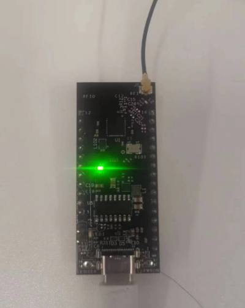
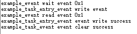
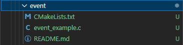
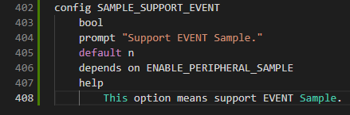
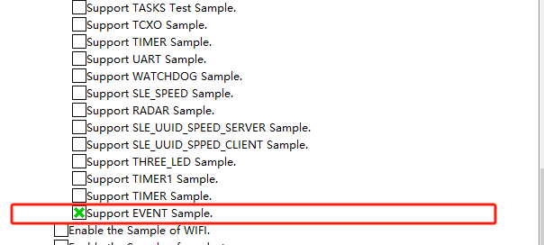
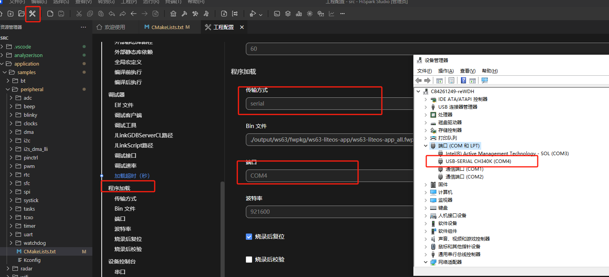

## 任务

## 1.1 介绍

**功能介绍：** 本实验内容实现了任务间的同步，多任务环境下，任务之间往往需要同步操作，一个等待即是一个同步，事件可以提供一对多、多对多的同步操作。

**软件概述：** 写事件时，对指定事件写入指定的事件类型，可以一次同时写多个事件类型。读事件可以选取读取模式，所有事件，读取掩码中所有事件类型，只有读取的所有事件类型都发生，才能读取成功；任一事件，读取掩码中任一事件类型，读取的事件中任一一种类型发生，即可读取成功。

**硬件概述：** 核心板。硬件搭建要求如图所示：

## 1.2 约束与限制

### 1.2.1 支持应用运行的芯片和开发板

本示例支持开发板：HiHope_NearLink_DK3863E_V03

### 1.2.2 支持API版本、SDK版本

本示例支持版本号：1.10.101

### 1.2.3 支持IDE版本、支持配套工具版本

本示例支持IDE版本号：1.0.0.6；

## 1.3 效果预览

## 1.4 接口介绍

### 1.4.1 osal_event_init()

| **定义：**   | int osal_event_init(osal_event *event_obj); |
| ------------ | ------------------------------------------- |
| **功能：**   | 初始化一个事件控制模块                      |
| **参数：**   | event_obj：事件                             |
| **返回值：** | OSAL_SUCCESS：成功    Other：OSAL_FAILURE   |
| **依赖：**   | kernel\osal\include\event\osal_event.h      |

### 1.4.2 osal_event_read()

| 定义：       | int osal_event_read(osal_event *event_obj, unsigned int mask, unsigned int timeout_ms, unsigned int mode); |
| ------------ | ---------------------------------------------------------------------------------------------------------- |
| **功能：**   | 阻塞读取指定事件类型，等待超时时间为相对时间，单位：ms                                                     |
| **参数：**   | event_obj：事件 mask：事件掩码  timeout_ms：超时时间 mode：事件类型                            |
| **返回值：** | OSAL_SUCCESS：成功    Other：OSAL_FAILURE                                                                  |
| **依赖：**   | kernel\osal\include\event\osal_event.h                                                                     |

### 1.4.3 osal_event_write()

| **定义：**   | int osal_event_write(osal_event *event_obj, unsigned int mask); |
| ------------ | --------------------------------------------------------------- |
| **功能：**   | 写指定的事件类型                                                |
| **参数：**   | event_obj：事件 mask：事件掩码                              |
| **返回值：** | OSAL_SUCCESS：成功    Other：OSAL_FAILURE                       |
| **依赖：**   | kernel\osal\include\event\osal_event.h                          |

### 1.4.4 osal_event_clear()

| **定义：**   | int osal_event_clear(osal_event *event_obj, unsigned int mask); |
| ------------ | --------------------------------------------------------------- |
| **功能：**   | 清除指定的事件类型                                              |
| **参数：**   | event_obj：事件 mask：事件掩码                              |
| **返回值：** | OSAL_SUCCESS：成功    Other：OSAL_FAILURE                       |
| **依赖：**   | kernel\osal\include\event\osal_event.h                          |

### 1.4.5 osal_event_destroy()

| **定义：**   | errcode_t uapi_timer_deinit(void);        |
| ------------ | ----------------------------------------- |
| **功能：**   | 销毁指定的事件控制块                      |
| **参数：**   | void类型                                  |
| **返回值：** | OSAL_SUCCESS：成功    Other：OSAL_FAILURE |
| **依赖：**   | kernel\osal\include\event\osal_event.h    |

## 1.5 具体实现

步骤一：调用事件初始化osal_event_init接口，初始化事件等待队列。

步骤二：写事件osal_event_write，配置事件掩码类型。

步骤三：读事件osal_event_read，选择读取模式。

步骤四：清除事件osal_event_clear，清除指定事件类型

## 1.6 实验流程

- 步骤一：在xxx\src\application\samples\peripheral文件夹新建一个sample文件夹，在peripheral上右键选择“新建文件夹”，创建Sample文件夹，例如名称”event“。

  
- 步骤二：将xxx\vendor\HiHope_NearLink_DK_WS63E_V03\event文件里面内容拷贝到**步骤一创建的Sample文件夹中”event“**。

  
- 步骤三：在xxx\src\application\samples\peripheral\CMakeLists.txt文件中新增编译案例，具体如下图所示（如果不知道在哪个地方加的，可以在“set(SOURCES "${SOURCES}" PARENT_SCOPE)”上面一行添加）。

  
- 步骤四：在xxx\src\application\samples\peripheral\Kconfig文件中新增编译案例，具体如下图所示（如果不知道在哪个地方加，可以在最后一行添加）。

  
- 步骤五：点击如下图标，选择KConfig，具体选择路径“Application/Enable the Sample of peripheral”，在弹出框中选择“support EVENT Sample”，点击Save，关闭弹窗。

  
- 步骤六：点击“build”或者“rebuild”编译

  
- 步骤七：编译完成如下图所示。

  
- 步骤八：在HiSpark Studio工具中点击“工程配置”按钮，选择“程序加载”，传输方式选择“serial”，端口选择“comxxx”，com口在设备管理器中查看（如果找不到com口，请参考windows环境搭建）。

  
- 步骤九：配置完成后，点击工具“程序加载”按钮烧录。

  
- 步骤十：出现“Connecting, please reset device...”字样时，复位开发板，等待烧录结束。

  
- 步骤十一：软件烧录成功后，按一下开发板的RESET按键复位开发板，烧录完成后，串口打印信息如下。

  
