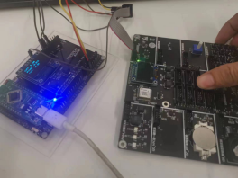
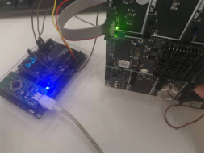
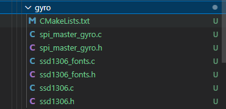
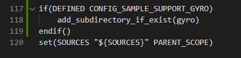
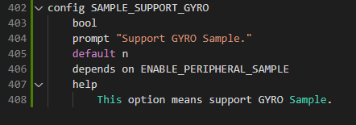
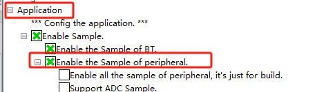
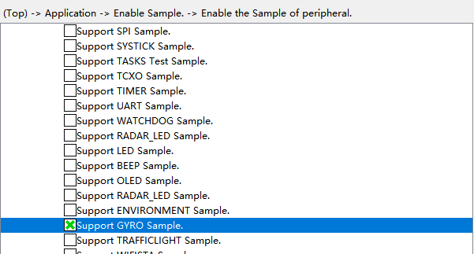

# gyro

## 1.1 介绍

**功能介绍：** 通过陀螺仪模块在SSD1306 OLED屏幕显示当前偏航角、俯仰角、横滚角。

**软件概述：** SPI是一种同步数据通信总线，它支持全双工操作，可配置为3种工作模式：单主单从、单主多从、多主多从。SPI至少需要4根线，分别是主机输入从机输出MISO、时钟SCLK、片选CS，但如果只连接一个从机，则可以省略CS信号。

**硬件概述：** 核心板、OLED板，OLED数据手册参考：https://gitee.com/HiSpark/hi3861_hdu_iot_application/issues/I6WPSS?from=project-issue 里面的液晶显示器.pdf。 通过OLED板原理图可以看出OLED板SDA与底板TX、SCL与底板RX，底板左边TX对应核心板TXD1，底板左边RX对应核心板RXD1;陀螺仪数据手册参考https://gitee.com/HiSpark/hi3861_hdu_iot_application/issues/I6WPSS?from=project-issue 里面的陀螺仪.pdf;硬件搭建要求如图所示：

参考[核心板板原理图](../../../../docs/hardware/HiHope_NearLink_DK_WS63E_V03/HIHOPE_NEARLINK_DK_3863E_V03.pdf)、[OLED板原理图](../../../../docs/hardware/HiHope_NearLink_DK_WS63E_V03/HiSpark_WiFi_IoT_OLED_VER.A.pdf)、[底板原理图](../../../../docs/hardware/HiHope_NearLink_DK_WS63E_V03/HiSpark_WiFi_IoT_EXB_VER.A.pdf)

## 1.2 约束与限制

### 1.2.1 支持应用运行的芯片和开发板

本示例支持开发板：HiHope_NearLink_DK3863E_V03

### 1.2.2 支持API版本、SDK版本

本示例支持版本号：1.10.101

### 1.2.3 支持IDE版本、支持配套工具版本

本示例支持IDE版本号：1.0.0.6；

## 1.3 效果预览

板上小屏幕实时显示当前偏航角、俯仰角、横滚角。

## 1.4 接口介绍

### 1.4.1 uapi_spi_init()

| **定义：**   | eerrcode_t uapi_spi_init(spi_bus_t bus, spi_attr_t *attr, spi_extra_attr_t *extra_attr); |
| ------------ | ---------------------------------------------------------------------------------------- |
| **功能：**   | 初始化 SPI                                                                               |
| **参数：**   | bus：指定的SPI接口 attr：SPI的基础配置参数   extra_attr：SPI的高级配置参数       |
| **返回值：** | ERRCODE_SUCC：成功    Other：失败                                                        |
| **依赖：**   | include\driver\spi.h                                                                     |

### 1.4.2 uapi_spi_master_write()

| 定义：       | errcode_t uapi_spi_master_write(spi_bus_t bus, const spi_xfer_data_t *data, uint32_t timeout);                                                                        |
| ------------ | --------------------------------------------------------------------------------------------------------------------------------------------------------------------- |
| **功能：**   | 将数据从主机写入到从机。有两种方式,一种是手动切换模式，另外一种是自动切换模式，两种方式是静态配置的 手动切换方式一共有以下三种传输模式，但是不能在同一bus中同时使用。 |
| **参数：**   | bus：指定的SPI接口 data：数据传输指针   timeout：当前传输的超时时间                                                                                           |
| **返回值：** | ERRCODE_SUCC：成功    Other：失败                                                                                                                                     |
| **依赖：**   | include\driver\spi.h                                                                                                                                                  |

### 1.4.3 uapi_spi_master_read()

| **定义：**   | errcode_t uapi_spi_master_read(spi_bus_t bus, const spi_xfer_data_t *data, uint32_t timeout);                                                                             |
| ------------ | ------------------------------------------------------------------------------------------------------------------------------------------------------------------------- |
| **功能：**   | 从slave读取数据。有两种方式,一种是手动切换模式，另外一种是自动切换模式，两种方式是静态配置的。手动切换方式一共有以下三种传输模式，但是不能在同一bus中同时使用bus：I2C总线 |
| **参数：**   | bus：指定的SPI接口 data：数据传输指针   timeout：当前传输的超时时间                                                                                               |
| **返回值：** | ERRCODE_SUCC：成功    Other：失败                                                                                                                                         |
| **依赖：**   | include\driver\spi.h                                                                                                                                                      |

### 1.4.4 uapi_spi_master_writeread()

| **定义：**   | errcode_t uapi_spi_master_writeread(spi_bus_t bus, const spi_xfer_data_t *data, uint32_t timeout);                                                                   |
| ------------ | -------------------------------------------------------------------------------------------------------------------------------------------------------------------- |
| **功能：**   | 主机写入和读取数据。有两种方式,一种是手动切换模式，另外一种是自动切换模式，两种方式是静态配置的。手动切换方式一共有以下两种种传输模式，但是不能在同一bus中同时使用。 |
| **参数：**   | bus：指定的SPI接口 data：数据传输指针   timeout：当前传输的超时时间                                                                                          |
| **返回值：** | ERRCODE_SUCC：成功    Other：失败                                                                                                                                    |
| **依赖：**   | include\driver\spi.h                                                                                                                                                 |

### 1.4.5 uapi_pin_set_mode()

| **定义：**   | errcode_t uapi_pin_set_mode(pin_t pin, pin_mode_t mode); |
| ------------ | -------------------------------------------------------- |
| **功能：**   | 设置引脚复用模式                                         |
| **参数：**   | pin：io mode：复用模式                               |
| **返回值：** | ERRCODE_SUCC：成功    Other：失败                        |
| **依赖：**   | include\driver\pinctrl.h                                 |

### 1.4.6 ssd1306_SetCursor()

| **定义：**   | void ssd1306_SetCursor(uint8_t x, uint8_t y); |
| ------------ | --------------------------------------------- |
| **功能：**   | 设置字符串显示位置                            |
| **参数：**   | x：横坐标 y：众坐标                       |
| **返回值：** | 无返回值                                      |
| **依赖：**   | oled\ssd1306.h                                |

### 1.4.7 ssd1306_DrawString()

| **定义：**   | char ssd1306_DrawString(char *str, FontDef Font, SSD1306_COLOR color); |
| ------------ | ---------------------------------------------------------------------- |
| **功能：**   | 设置输出的字符串                                                       |
| **参数：**   | str：要输出的字符串 Font：字符串大小  color：颜色              |
| **返回值：** | ERRCODE_SUCC：成功    Other：失败                                      |
| **依赖：**   | oled\ssd1306.h                                                         |

### 1.4.8 ssd1306_UpdateScreen()

| **定义：**   | void ssd1306_UpdateScreen(void); |
| ------------ | -------------------------------- |
| **功能：**   | 在屏幕显示字符串                 |
| **参数：**   | 无                               |
| **返回值：** | 无                               |
| **依赖：**   | oled\ssd1306.h                   |

## 1.5 具体实现

步骤一：初始化I2C设备；

步骤二：I2C通信正常后，初始化OLED；

步骤三：通过数据手册中协议要求，发送数据

## 1.6 实验流程

- 步骤一：在xxx\src\application\samples\peripheral文件夹新建一个sample文件夹，在peripheral上右键选择“新建文件夹”，创建Sample文件夹，例如名称”gyro“。

  
- 步骤二：将xxx\vendor\HiHope_NearLink_DK_WS63E_V03\gyro文件里面内容拷贝到**步骤一创建的Sample文件夹中”gyro“**。

  
- 步骤三：在xxx\src\application\samples\peripheral\CMakeLists.txt文件中新增编译案例，具体如下图所示（如果不知道在哪个地方加的，可以在“set(SOURCES "${SOURCES}" PARENT_SCOPE)”上面一行添加）。

  
- 步骤四：在xxx\src\application\samples\peripheral\Kconfig文件中新增编译案例，具体如下图所示（如果不知道在哪个地方加，可以在最后一行添加）。

  
- 步骤五：点击如下图标，选择KConfig，具体选择路径“Application/Enable the Sample of peripheral”，在弹出框中选择“support ENVIRONMENT Sample”，点击Save，关闭弹窗。

  
- 步骤六：点击“build”或者“rebuild”编译

  
- 步骤七：编译完成如下图所示。

  
- 步骤八：在HiSpark Studio工具中点击“工程配置”按钮，选择“程序加载”，传输方式选择“serial”，端口选择“comxxx”，com口在设备管理器中查看（如果找不到com口，请参考windows环境搭建）。

  
- 步骤九：配置完成后，点击工具“程序加载”按钮烧录。

  
- 步骤十：出现“Connecting, please reset device...”字样时，复位开发板，等待烧录结束。

  
- 步骤十一：“软件烧录成功后，按一下开发板的RESET按键复位开发板，板上小屏幕实时显示当前偏航角、俯仰角、横滚角。

  
