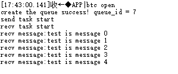
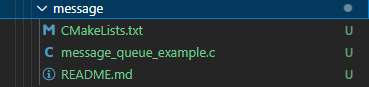
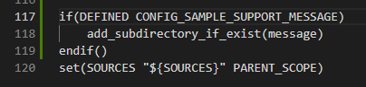
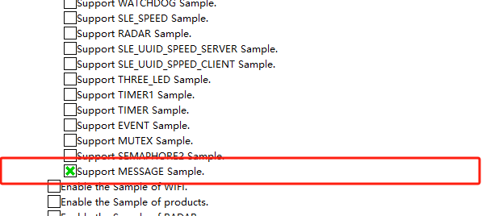

## message

## 1.1 介绍

**功能介绍：** 本实验内容实现了创建一个队列，两个任务，任务1调用发送接口发送消息，任务2通过接收接口接收消息。

**软件概述：** 队列又称消息队列，是一种常用于任务间通信的数据结构，实现了接收来自任务或中断的不固定长度的消息，接收方根据消息ID读取消息。系统中使用队列数据结构实现任务异步通信工作，具有如下特性：

- 消息以先进先出方式排队，支持异步读写工作方式。
- 读队列和写队列都支持超时机制。
- 发送消息类型由通信双方约定，可以允许不同长度（不超过队列节点最大值）消息。
- 一个任务能够从任意一个消息队列接收和发送消息。
- 多个任务能够从同一个消息队列接收和发送消息。
- 当队列使用结束后，如果是动态申请的内存，需要通过释放内存函数回收。

**硬件概述：** 核心板。硬件搭建要求如图所示：

## 1.2 约束与限制

### 1.2.1 支持应用运行的芯片和开发板

本示例支持开发板：HiHope_NearLink_DK3863E_V03

### 1.2.2 支持API版本、SDK版本

本示例支持版本号：1.10.101

### 1.2.3 支持IDE版本、支持配套工具版本

本示例支持IDE版本号：1.0.0.6；

## 1.3 效果预览

## 1.4 接口说明

### 1.4.1 osal_msg_queue_creat()

| **定义：**   | int osal_msg_queue_create(const char *name, unsigned short queue_len, unsigned long *queue_id, unsigned int flags,unsigned short max_msgsize);                                                                          |
| ------------ | ----------------------------------------------------------------------------------------------------------------------------------------------------------------------------------------------------------------------- |
| **功能：**   | 创建消息队列                                                                                                                                                                                                            |
| **参数：**   | name：消息队列名称 queue_len：队列长度。值范围为[1,0xffff] queue_id：成功创建的队列控制结构的ID flags：队列模式 max_msgsize：节点大小。值范围为[1,0xffff]，注意节点不宜过大也不易过小，可以参考代码注释 |
| **返回值：** | OSAL_SUCCESS：成功    Other：OSAL_FAILURE                                                                                                                                                                               |
| **依赖：**   | kernel\osal\include\msgqueue\osal_msgqueue.h                                                                                                                                                                            |

### 1.4.2 osal_msg_queue_delete()

| 定义：       | void osal_msg_queue_delete(unsigned long queue_id); |
| ------------ | --------------------------------------------------- |
| **功能：**   | 删除消息队列                                        |
| **参数：**   | queue_id：成功创建的队列控制结构的ID                |
| **返回值：** | OSAL_SUCCESS：成功    Other：OSAL_FAILURE           |
| **依赖：**   | kernel\osal\include\msgqueue\osal_msgqueue.h        |

### 1.4.3 osal_msg_queue_write_copy()

| **定义：**   | int osal_msg_queue_write_copy(unsigned long queue_id, void *buffer_addr, unsigned int buffer_size, unsigned int timeout);            |
| ------------ | ------------------------------------------------------------------------------------------------------------------------------------ |
| **功能：**   | 发送消息到队列尾部                                                                                                                   |
| **参数：**   | queue_id：成功创建的队列控制结构的ID buffer_addr：存储要写入的数据的起始地址 buffer_size：写入数据长度 timeout：超时时间 |
| **返回值：** | OSAL_SUCCESS：成功    Other：OSAL_FAILURE                                                                                            |
| **依赖：**   | kernel\osal\include\msgqueue\osal_msgqueue.h                                                                                         |

### 1.4.4 osal_msg_queue_read_copy()

| **定义：**   | int osal_msg_queue_read_copy(unsigned long queue_id, void *buffer_addr, unsigned int *buffer_size,unsigned int timeout);     |
| ------------ | ---------------------------------------------------------------------------------------------------------------------------- |
| **功能：**   | 阻塞接收信息，单位：ms                                                                                                       |
| **参数：**   | queue_id：成功创建的队列控制结构的ID buffer_addr：读取数据的起始地址 buffer_size：读取数据长度 timeout：超时时间 |
| **返回值：** | OSAL_SUCCESS：成功    Other：OSAL_FAILURE                                                                                    |
| **依赖：**   | kernel\osal\include\msgqueue\osal_msgqueue.h                                                                                 |

## 1.5 具体实现

步骤一：创建一个队列，两个任务，任务1调用发送接口发送消息，任务二通过接收窗口接收消息。

步骤二：通过osal_kthread_creat创建任务1和任务2。

步骤三：通过osal_msg_queue_creat创建一个消息队列。

步骤四：在任务1调用osal_msg_queue_write_copy发送消息。

步骤五：在任务2调用osal_msg_queue_read_copy接收消息。

## 1.6实验流程

- 步骤一：在xxx\src\application\samples\peripheral文件夹新建一个sample文件夹，在peripheral上右键选择“新建文件夹”，创建Sample文件夹，例如名称”message“。

  
- 步骤二：将xxx\vendor\HiHope_NearLink_DK_WS63E_V03\message文件里面内容拷贝到**步骤一创建的Sample文件夹中”message“**。

  
- 步骤三：在xxx\src\application\samples\peripheral\CMakeLists.txt文件中新增编译案例，具体如下图所示（如果不知道在哪个地方加的，可以在“set(SOURCES "${SOURCES}" PARENT_SCOPE)”上面一行添加）**。

  
- 步骤四：在xxx\src\application\samples\peripheral\Kconfig文件中新增编译案例，具体如下图所示（如果不知道在哪个地方加，可以在最后一行添加）。

  
- 步骤五：点击如下图标，选择KConfig，具体选择路径“Application/Enable the Sample of peripheral”，在弹出框中选择“support A6_KERNAL_MESSAGE Sample”，点击Save，关闭弹窗。

  
- 步骤六：点击“build”或者“rebuild”编译

  
- 步骤七：编译完成如下图所示。

  
- 步骤八：在HiSpark Studio工具中点击“工程配置”按钮，选择“程序加载”，传输方式选择“serial”，端口选择“comxxx”，com口在设备管理器中查看（如果找不到com口，请参考windows环境搭建）。

  
- 步骤九：配置完成后，点击工具“程序加载”按钮烧录。

  
- 步骤十：出现“Connecting, please reset device...”字样时，复位开发板，等待烧录结束。

  
- 步骤十一：软件烧录成功后，按一下开发板的RESET按键复位开发板，烧录完成后，串口打印信息如下。

  
