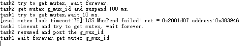
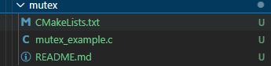
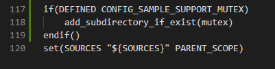
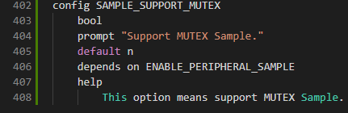
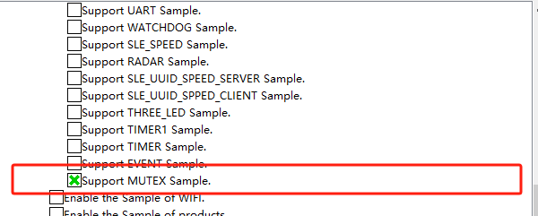

# mutex

## 1.1 介绍

**功能介绍：** 本实验内容实现了防止两个任务在同一时刻访问相同共享资源。

**软件概述：** 互斥锁又称互斥型信号量，是一种特殊的二值性信号量，用于实现对共享资源的独占式处理。任意时刻互斥锁的状态只有两种：闭锁，当有任务持有时，这个任务获得该互斥锁的所有权；开锁，当该任务释放它时，该互斥锁被开锁，任务失去该互斥锁的所有权。当一个任务持有互斥锁时，其他任务将不能再对该互斥锁进行开锁或持有。多任务环境下往往存在多个任务竞争同一共享资源的应用场景，互斥锁可被用于对共享资源的保护从而实现独占式访问。

**硬件概述：** 核心板。硬件搭建要求如图所示：

## 1.2 约束与限制

### 1.2.1 支持应用运行的芯片和开发板

本示例支持开发板：HiHope_NearLink_DK3863E_V03

### 1.2.2 支持API版本、SDK版本

本示例支持版本号：1.10.101

### 1.2.3 支持IDE版本、支持配套工具版本

本示例支持IDE版本号：1.0.0.6；

## 1.3 效果预览

## 1.4 接口说明

### 1.4.1 osal_mutex_init()

| **定义：**   | int osal_mutex_init(osal_mutex *mutex);   |
| ------------ | ----------------------------------------- |
| **功能：**   | 初始化互斥锁                              |
| **参数：**   | mutex：互斥对象                           |
| **返回值：** | OSAL_SUCCESS：成功    Other：OSAL_FAILURE |
| **依赖：**   | kernel\osal\include\mutex\osal_mutex.h    |

### 1.4.2 osal_mutex_destroy()

| 定义：       | void osal_mutex_destroy(osal_mutex *mutex); |
| ------------ | ------------------------------------------- |
| **功能：**   | 删除指定的互斥锁                            |
| **参数：**   | mutex：互斥对象                             |
| **返回值：** | OSAL_SUCCESS：成功    Other：OSAL_FAILURE   |
| **依赖：**   | kernel\osal\include\mutex\osal_mutex.h      |

### 1.4.3 osal_mutex_lock_timeout()

| **定义：**   | int osal_mutex_lock_timeout(osal_mutex *mutex, unsigned int timeout); |
| ------------ | --------------------------------------------------------------------- |
| **功能：**   | 阻塞获取互斥锁，单位：ms                                              |
| **参数：**   | mutex：互斥对象 timeout：超时时间                                 |
| **返回值：** | OSAL_SUCCESS：成功    Other：OSAL_FAILURE                             |
| **依赖：**   | kkernel\osal\include\mutex\osal_mutex.h                               |

### 1.4.4 osal_event_unlock()

| **定义：**   | void osal_mutex_unlock(osal_mutex *mutex); |
| ------------ | ------------------------------------------ |
| **功能：**   | 释放指定互斥锁                             |
| **参数：**   | mutex：互斥对象                            |
| **返回值：** | OSAL_SUCCESS：成功    Other：OSAL_FAILURE  |
| **依赖：**   | kernel\osal\include\mutex\osal_mutex.h     |

## 1.5 具体实现

步骤一：任务example_task_mux创建一个互斥锁，锁任务调度，创建两个任务example_mutex_task1、example_mutex_task2，example_mutex_task2优先级高于example_mutex_task1，解锁任务调度。

步骤二：example_mutex_task2被调度，永久申请互斥锁，然后任务休眠100ms，example_mutex_task2挂起，example_mutex_task1被唤醒。

步骤三：example_mutex_task1申请互斥锁，等待时间为10ms，因互斥锁仍被example_mutex_task2持有，example_mutex_task1挂起，10ms后未拿到互斥锁，example_mutex_task1被唤醒，试图以永久等待申请互斥锁，example_mutex_task1挂起。

步骤四：100ms后example_mutex_task2唤醒，释放互斥锁后，example_mutex_task1被调度运行后释放互斥锁。

步骤五：example_mutex_task1执行完，300ms后，删除互斥锁。

## 1.6 实验流程

- 步骤一：在xxx\src\application\samples\peripheral文件夹新建一个sample文件夹，在peripheral上右键选择“新建文件夹”，创建Sample文件夹，例如名称”mutex“。

  
- 步骤二：将xxx\vendor\HiHope_NearLink_DK_WS63E_V03\mutex文件里面内容拷贝到**步骤一创建的Sample文件夹中”mutex“**。

  
- 步骤三：在xxx\src\application\samples\peripheral\CMakeLists.txt文件中新增编译案例，具体如下图所示（如果不知道在哪个地方加的，可以在“set(SOURCES "${SOURCES}" PARENT_SCOPE)”上面一行添加）。

  
- 步骤四：在xxx\src\application\samples\peripheral\Kconfig文件中新增编译案例，具体如下图所示（如果不知道在哪个地方加，可以在最后一行添加）。

  
- 步骤五：点击如下图标，选择KConfig，具体选择路径“Application/Enable the Sample of peripheral”，在弹出框中选择“support MUTEX Sample”，点击Save，关闭弹窗。

  
- 步骤六：点击“build”或者“rebuild”编译

  
- 步骤七：编译完成如下图所示。

  
- 步骤八：在HiSpark Studio工具中点击“工程配置”按钮，选择“程序加载”，传输方式选择“serial”，端口选择“comxxx”，com口在设备管理器中查看（如果找不到com口，请参考windows环境搭建）。

  
- 步骤九：配置完成后，点击工具“程序加载”按钮烧录。

  
- 步骤十：出现“Connecting, please reset device...”字样时，复位开发板，等待烧录结束。

  
- 步骤十一：软件烧录成功后，按一下开发板的RESET按键复位开发板，烧录完成后，串口打印信息如下。

  
