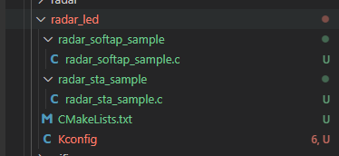
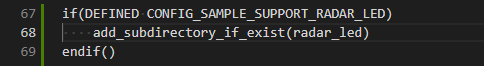
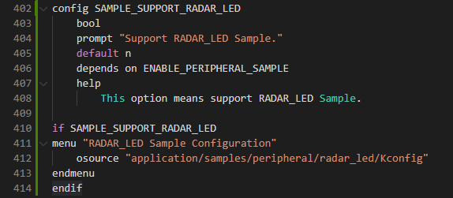
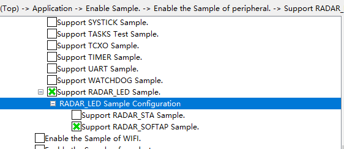

# radar_led

## 1.1 介绍

**功能介绍：** 雷达运动感知，检测物体在6M以内是否有运动。如果有则亮绿灯，如果检测物体在0M-1M以内，则亮红灯，如果检测物体在1M-2M以内，则亮绿灯。

**硬件概述：** 核心板、交通灯板。通过板端丝印可以看出交通灯板的蜂鸣器BEEP与底板的A9相连，底板左边A9对应核心板GPIO 9。硬件搭建要求如图所示：

参考[核心板原理图](../../../../docs/hardware/HiHope_NearLink_DK_WS63E_V03/HIHOPE_NEARLINK_DK_3863E_V03.pdf)、[交通灯板原理图](../../../../docs/hardware/HiHope_NearLink_DK_WS63E_V03/HiSpark_WiFi_IoT_SSL_VER.A.pdf)、[底板原理图](../../../../docs/hardware/HiHope_NearLink_DK_WS63E_V03/HiSpark_WiFi_IoT_EXB_VER.A.pdf)

## 1.2 约束与限制

### 1.2.1 支持应用运行的芯片和开发板

本示例支持开发板：HiHope_NearLink_DK3863E_V03

### 1.2.2 支持API版本、SDK版本

本示例支持版本号：1.10.101

### 1.2.3 支持IDE版本、支持配套工具版本

本示例支持IDE版本号：1.0.0.6；

## 1.3 效果预览

检测物体在6M以内是否有运动。如果有则亮绿灯，如果检测物体在0M-1M以内，则亮红灯，如果检测物体在1M-2M以内，则亮绿灯。

## 1.4 接口介绍

### 1.4.1 wifi_softap_enable()

| **定义：**   | errcode_t wifi_softap_enable(const softap_config_stru *config); |
| ------------ | --------------------------------------------------------------- |
| **功能：**   | 开启SoftAP                                                      |
| **参数：**   | config：SoftAp的配置                                            |
| **返回值：** | ERROCODE_SUCC：成功    Other：失败                              |
| **依赖：**   | include\middleware\services\wifi\wifi_hotspot.h                 |

### 1.4.2 netifapi_netif_set_addr()

| **定义：**   | err_t netifapi_netif_set_addr(struct netif *netif, const ip4_addr_t *ipaddr, const ip4_addr_t *netmask, const ip4_addr_t *gw); |
| ------------ | ------------------------------------------------------------------------------------------------------------------------------ |
| **功能：**   | 设置网络接口的IP地址                                                                                                           |
| **返回值：** | ERROCODE_SUCC：成功    Other：失败                                                                                             |
| **依赖：**   | open_source\lwip\lwip_v2.1.3\src\include\lwip\netifapi.h                                                                       |

### 1.4.3 netifapi_dhcps_start()

| **定义：**   | err_t netifapi_dhcps_start(struct netif *netif, char *start_ip, u16_t ip_num); |
| ------------ | ------------------------------------------------------------------------------ |
| **功能：**   | 启动dhcp服务                                                                   |
| **返回值：** | ERROCODE_SUCC：成功    Other：失败                                             |
| **依赖：**   | open_source\lwip\lwip_v2.1.3\src\include\lwip\netifapi.h                       |

### 1.4.4 uapi_radar_register_result_cb()

| **定义：**   | errcode_t uapi_radar_register_result_cb(radar_result_cb_t cb); |
| ------------ | -------------------------------------------------------------- |
| **功能：**   | 雷达结果回调注册函数                                           |
| **参数：**   | cb：回调函数                                                   |
| **返回值：** | 执行结果错误码                                                 |
| **依赖：**   | include\middleware\services\radar\radar_service.h              |

### 1.4.5 uapi_radar_set_status()

| **定义：**   | errcode_t uapi_radar_set_status(uint8_t sts);     |
| ------------ | ------------------------------------------------- |
| **功能：**   | 设置雷达状态                                      |
| **参数：**   | sts：雷达状态                                     |
| **返回值：** | 执行结果错误码                                    |
| **依赖：**   | include\middleware\services\radar\radar_service.h |

### 1.4.6 uapi_radar_set_delay_time()

| **定义：**   | errcode_t uapi_radar_set_delay_time(uint16_t time); |
| ------------ | --------------------------------------------------- |
| **功能：**   | 设置退出延迟时间                                    |
| **参数：**   | time：退出延迟时间                                  |
| **返回值：** | 执行结果错误码                                      |
| **依赖：**   | include\middleware\services\radar\radar_service.h   |

## 1.5 具体实现

步骤一：启动WiFi STA或者WiFi AP模式。

步骤二：启动成功后，初始化雷达参数，并注册雷达结果回调函数。

步骤三：设置雷达状态，并设备雷达退出延迟时间。

## 1.6 实验流程

- 步骤一：在xxx\src\application\samples\peripheral文件夹新建一个sample文件夹，在peripheral上右键选择“新建文件夹”，创建Sample文件夹，例如名称”radar_led“。

  
- 步骤二：将xxx\vendor\HiHope_NearLink_DK_WS63E_V03\radar_led文件里面内容拷贝到**步骤一创建的Sample文件夹中”radar_led“**下。

  
- 步骤三：在xxx\src\application\samples\peripheral\CMakeLists.txt文件中新增编译案例，具体如下图所示（如果不知道在哪个地方加的，可以在“set(SOURCES "${SOURCES}" PARENT_SCOPE)”上面一行添加）。

  
- 步骤四：在xxx\src\application\samples\peripheral\Kconfig文件中新增编译案例，具体如下图所示（如果不知道在哪个地方加，可以在最后一行添加）。

  
- 步骤五：点击如下图标，选择KConfig，具体选择路径“Application/Enable Sample ”，如果选择编译RADAR_SOFTAP，在弹出框中选择“support  RADAR_SOFTAP Sample”，点击Save，关闭弹窗；如果选择编译RADAR_STA ，在弹出框中选择“support RADAR_STA Sample”，点击Save，关闭弹窗。（需要准备两块开发板，选择不同的编译选项，烧录不同的镜像）

  
- 步骤六：点击“build”或者“rebuild”编译

  
- 步骤七：编译完成如下图所示。

  
- 步骤八：在HiSpark Studio工具中点击“工程配置”按钮，选择“程序加载”，传输方式选择“serial”，端口选择“comxxx”，com口在设备管理器中查看（如果找不到com口，请参考windows环境搭建）。

  
- 步骤九：配置完成后，点击工具“程序加载”按钮烧录。

  
- 步骤十：出现“Connecting, please reset device...”字样时，复位开发板，等待烧录结束。

  
- 步骤七：检测到物体在6M以内正在移动，亮绿灯，检测到物体在0M-1M以内运动，亮红灯，检测到物体在1M-2M，亮黄灯。
