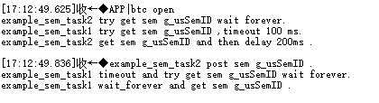
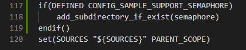
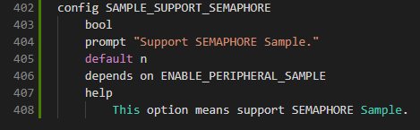
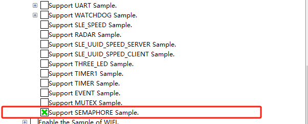

## semaphore

## 1.1 介绍

**功能介绍：** 本实验内容实现了两个任务之间同步获取信号量。

**软件概述：** 信号量（Semaphore）是一种实现任务间通信的机制，实现任务之间同步或临界资源的互斥访问。常用于协助一组相互竞争的任务来访问临界资源。在多任务系统中，各任务之间需要同步或互斥实现临界资源的保护，信号量功能可以为用户提供这方面的支持。通常一个信号量的计数值用于对应有效的资源数表示剩下的可被占用的互斥资源数。

**硬件概述：** 核心板。硬件搭建要求如图所示：


## 1.2 约束与限制

### 1.2.1 支持应用运行的芯片和开发板

本示例支持开发板：HiHope_NearLink_DK3863E_V03

### 1.2.2 支持API版本、SDK版本

本示例支持版本号：1.10.101

### 1.2.3 支持IDE版本、支持配套工具版本

本示例支持IDE版本号：1.0.0.6；

## 1.3 效果预览



## 1.4 接口说明

### 1.4.1 osal_sem_init()


| **定义：**   | int osal_sem_init(osal_semaphore *sem, int val); |
| ------------ | ------------------------------------------------ |
| **功能：**   | 创建信号量                                       |
| **参数：**   | sem：信号量对象<br/>val：可用信号量初始化数量    |
| **返回值：** | OSAL_SUCCESS：成功    Other：OSAL_FAILURE        |
| **依赖：**   | kernel\osal\include\semaphore\osal_semaphore.h   |

### 1.4.2 osal_sem_binary_sem_init()


| 定义：       | int osal_sem_binary_sem_init(osal_semaphore *sem, int val); |
| ------------ | ----------------------------------------------------------- |
| **功能：**   | 创建二进制信号量                                            |
| **参数：**   | sem：信号量对象<br/>val：可用信号量初始化数量，范围[0, 1]   |
| **返回值：** | OSAL_SUCCESS：成功    Other：OSAL_FAILURE                   |
| **依赖：**   | kernel\osal\include\semaphore\osal_semaphore.h              |

### 1.4.3 osal_sem_down_timeout()


| **定义：**   | int osal_sem_down_timeout(osal_semaphore *sem, unsigned int timeout); |
| ------------ | --------------------------------------------------------------------- |
| **功能：**   | 阻塞获取指定信号量，单位：ms                                          |
| **参数：**   | sem：信号量对象<br/>timeout：超时时间                                 |
| **返回值：** | OSAL_SUCCESS：成功    Other：OSAL_FAILURE                             |
| **依赖：**   | kernel\osal\include\semaphore\osal_semaphore.h                        |

### 1.4.4 osal_sem_up()


| **定义：**   | void osal_sem_up(osal_semaphore *sem);         |
| ------------ | ---------------------------------------------- |
| **功能：**   | 释放指定信号量                                 |
| **参数：**   | sem：信号量对象                                |
| **返回值：** | OSAL_SUCCESS：成功    Other：OSAL_FAILURE      |
| **依赖：**   | kernel\osal\include\semaphore\osal_semaphore.h |

## 1.5 具体流程

步骤一：创建信号量osal_sem_init或者osal_sem_binary_sem_init.

步骤二：申请信号量osal_sem_down_timeout。

信号量有3种申请模式：

```
无阻塞模式：任务需要申请信号量，若当前信号量的任务数没有到信号量设定的上限，则申请成功。否则，立即返回申请失败。超时时间设置为0。
```


```
永久阻塞模式：任务需要申请信号量，若当前信号量的任务数没有到信号量设定的上限，则申请成功。否则，该任务进入阻塞态，系统切换到就绪任务中优先级高者继续执行。任务进入阻塞态后，直到有其他任务释放该信号 量，阻塞任务才会重新得以执行。超时时间设置为HI_SYS_WAIT_FOREVER。
```


```
定时阻塞模式：任务需要申请信号量，若当前信号量的任务数没有到信号量设定的上限，则申请成功。否则，该任务进入阻塞态，系统切换到就绪任务中优先级.高者继续执行。任务进入阻塞态后，指定时间超时前有其他任务 释放该信号量，或者用户指定时间超时后，阻塞任务才会重新得以执行。超时时间设置为合理值。
```


步骤三：释放信号量osal_sem_up。如果有任务阻塞于指定信号量，则唤醒该信号量阻塞队列上的第一个任务。 该任务进入就绪态，并进行调度。 如果没有任务阻塞于指定信号量，释放信号量成功。

步骤四：删除信号量osal_sem_destroy。

## 1.6 实验流程

- 步骤一：在xxx\src\application\samples\peripheral文件夹新建一个sample文件夹，在peripheral上右键选择“新建文件夹”，创建Sample文件夹，例如名称”semaphore“。

  
- 步骤二：将xxx\vendor\HiHope_NearLink_DK_WS63E_V03\semaphore文件里面内容拷贝到**步骤一创建的Sample文件夹中”semaphore“**。


- 步骤三：在xxx\src\application\samples\peripheral\CMakeLists.txt文件中新增编译案例，具体如下图所示（如果不知道在哪个地方加的，可以在“set(SOURCES "${SOURCES}" PARENT_SCOPE)”上面一行添加）。

  
- 步骤四：在xxx\src\application\samples\peripheral\Kconfig文件中新增编译案例，具体如下图所示（如果不知道在哪个地方加，可以在最后一行添加）。

  
- 步骤五：点击如下图标，选择KConfig，具体选择路径“Application/Enable the Sample of peripheral”，在弹出框中选择“support SEMAPHORE Sample”，点击Save，关闭弹窗。

  
- 步骤六：点击“build”或者“rebuild”编译

  
- 步骤七：编译完成如下图所示。

  
- 步骤八：在HiSpark Studio工具中点击“工程配置”按钮，选择“程序加载”，传输方式选择“serial”，端口选择“comxxx”，com口在设备管理器中查看（如果找不到com口，请参考windows环境搭建）。

  
- 步骤九：配置完成后，点击工具“程序加载”按钮烧录。

  
- 步骤十：出现“Connecting, please reset device...”字样时，复位开发板，等待烧录结束。

  
- 步骤十一：软件烧录成功后，按一下开发板的RESET按键复位开发板，烧录完成后，串口打印信息如下。

  
