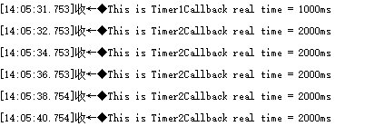
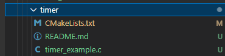
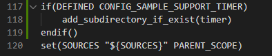
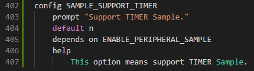
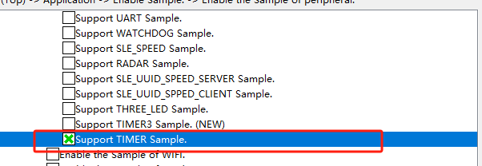

# timer

## 1.1 介绍

**功能介绍：** 本实验内容实现了创建两个软件定时器，实现了软件定时器创建、启动、单次软件定时器、周期软件定时器等使用方法。单次软件定时器在启动后只会触发一次定时器事件，周期软件定时器会周期性的触发定时器事件，直到手动停止定时器或者触发其他软件条件，否则永远执行。

**软件概述：** 软件定时器是基于系统Tick时钟中断且由软件来模拟的定时器，当经过设定的Tick时钟计数值后会触发用户定义的回调函数。定时精度与系统Tick时钟的周期有关。

**硬件概述：** 核心板。硬件搭建要求如图所示。

## 1.2 约束与限制

### 1.2.1 支持应用运行的芯片和开发板

本示例支持开发板：HiHope_NearLink_DK3863E_V03

### 1.2.2 支持API版本、SDK版本

本示例支持版本号：1.10.101

### 1.2.3 支持IDE版本、支持配套工具版本

本示例支持IDE版本号：1.0.0.6；

## 1.3 效果预览

任务1过1S只执行一次定时器中断，任务2每隔2S执行一次定时器中断

## 1.4 接口介绍

#### 1.4.1 uapi_time_init()

| **定义：**   | errcode uapi_time_init(void);     |
| ------------ | --------------------------------- |
| **功能：**   | 初始化定时器                      |
| **参数：**   | void类型                          |
| **返回值：** | ERRCODE_SUCC：成功    Other：失败 |
| **依赖：**   | include\driver\time.h             |

#### 1.4.2 uapi_timer_create()

| 定义：       | errcode_t uapi_timer_create(timer_index_t index, timer_handle_t *timer); |
| ------------ | ------------------------------------------------------------------------ |
| **功能：**   | 创建软件定时器                                                           |
| **参数：**   | index：硬件定时器索引 timer：定时器处理返回值。                      |
| **返回值：** | ERRCODE_SUCC：成功    Other：失败                                        |
| **依赖：**   | include\driver\time.h                                                    |

#### 1.4.3 uapi_timer_start()

| **定义：**   | errcode_t uapi_timer_start(timer_handle_t timer, uint32_t time_us, timer_callback_t callback, uintptr_t data);              |
| ------------ | --------------------------------------------------------------------------------------------------------------------------- |
| **功能：**   | 启动软件定时器，定时器超时时间（单位：ms）                                                                                  |
| **参数：**   | timer：创建的定时器 time_us：定时器超时时间 callback：定时器回调函数 data：定时器参数，用于传递给定时器回调函数 |
| **返回值：** | ERRCODE_SUCC：成功    Other：失败                                                                                           |
| **依赖：**   | include\driver\time.h                                                                                                       |

#### 1.4.4 uapi_timer_adapter()

| **定义：**   | errcode_t uapi_timer_adapter(timer_index_t index, uint32_t int_id, uint16_t int_priority); |
| ------------ | ------------------------------------------------------------------------------------------ |
| **功能：**   | 适配定时器                                                                                 |
| **参数：**   | index：硬件定时器索引 int_id：硬件定时器中断ID int_priority：硬件定时器中断优先级  |
| **返回值：** | ERRCODE_SUCC：成功    Other：失败                                                          |
| **依赖：**   | iinclude\driver\time.h                                                                     |

#### 1.4.5 uapi_timer_deinit()

| **定义：**   | errcode_t uapi_timer_deinit(void); |
| ------------ | ---------------------------------- |
| **功能：**   | 去初始化定时器                     |
| **参数：**   | void类型                           |
| **返回值：** | ERRCODE_SUCC：成功    Other：失败  |
| **依赖：**   | iinclude\driver\time.h             |

#### 1.4.6 uapi_timer_stop()

| **定义：**   | errcode_t uapi_timer_stop(timer_handle_t timer); |
| ------------ | ------------------------------------------------ |
| **功能：**   | 停止软件定时器                                   |
| **参数：**   | timer：uapi_timer_create 创建的定时器            |
| **返回值：** | ERRCODE_SUCC：成功    Other：失败                |
| **依赖：**   | iinclude\driver\time.h                           |

#### 1.4.7 uapi_timer_delete()

| **定义：**   | errcode_t uapi_timer_delete(timer_handle_t timer); |
| ------------ | -------------------------------------------------- |
| **功能：**   | 删除定时器                                         |
| **参数：**   | timer：创建的定时器                                |
| **返回值：** | ERRCODE_SUCC：成功    Other：失败                  |
| **依赖：**   | iinclude\driver\time.h                             |

## 1.5 具体实现

步骤一：初始化软件定时器，并创建两个软件定时器uapi_timer_create();

步骤二：分别启动单次软件定时器、周期软件定时器的启动

## 1.6 案例实现

- 步骤一：在xxx\src\application\samples\peripheral文件夹新建一个sample文件夹，在peripheral上右键选择“新建文件夹”，创建Sample文件夹，例如名称”timer“。

  
- 步骤二：将xxx\vendor\HiHope_NearLink_DK_WS63E_V03\timer文件里面内容“CMakeList.txt”、“timer_example.c”拷贝到**步骤一创建的Sample文件夹中”timer“**下。

  
- 步骤三：在xxx\src\application\samples\peripheral\CMakeLists.txt文件中新增编译案例，具体如下图所示（如果不知道在哪个地方加的，可以在“set(SOURCES "${SOURCES}" PARENT_SCOPE)”上面一行添加）。

  
- 步骤四：在xxx\src\application\samples\peripheral\Kconfig文件中新增编译案例，具体如下图所示（如果不知道在哪个地方加，可以在最后一行添加）。

  
- 步骤五：点击如下图标，选择KConfig，具体选择路径“Application/Enable the Sample of peripheral”，在弹出框中选择“support TIMER Sample”，点击Save，关闭弹窗。

  
- 步骤六：点击“build”或者“rebuild”编译

  
- 步骤七：编译完成如下图所示。

  
- 步骤八：在HiSpark Studio工具中点击“工程配置”按钮，选择“程序加载”，传输方式选择“serial”，端口选择“comxxx”，com口在设备管理器中查看（如果找不到com口，请参考windows环境搭建）。

  
- 步骤九：配置完成后，点击工具“程序加载”按钮烧录。

  
- 步骤十：出现“Connecting, please reset device...”字样时，复位开发板，等待烧录结束。

  
- 步骤十一：软件烧录成功后，按一下开发板的RESET按键复位开发板，烧录完成后，串口打印信息如下。

  
