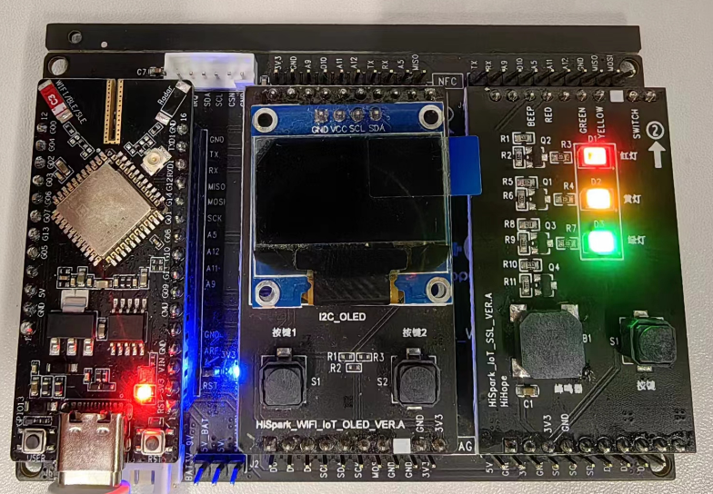
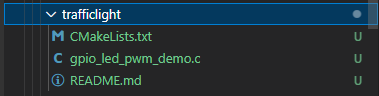
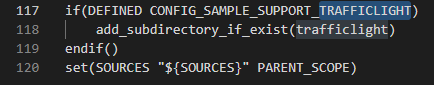
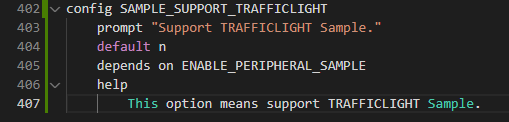
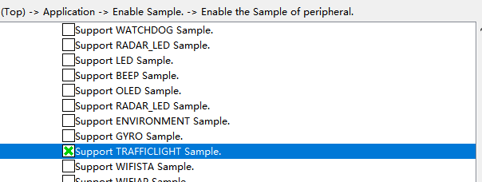

## trafficlight

## 1.1 介绍

**功能介绍：** 交通灯板上红、黄、绿三种颜色灯闪烁，同时按键可以控制蜂鸣器鸣响。

**软件概述：** GPIO引脚输出高低电平状态。

**硬件概述：** 核心板、交通灯板。通过交通灯板上丝印可以看出是RED与底板的D10相连，底板左边位置D10对应核心板上GPIO 7，GREEN与底板的A11相连，底板左边位置A11对应核心板上GPIO 11，YELLOW与底板的A12相连，底板左边位置A12对应核心板上GPIO 12，Switch与底板的MOSI相连，底板左边位置MOSI对应核心板上GPIO14，蜂鸣器BEEP与底板的A9相连，底板左边A9对应核心板GPIO 9。硬件搭建要求如图所示：

参考[核心板原理图](../../../../docs/hardware/HiHope_NearLink_DK_WS63E_V03/HIHOPE_NEARLINK_DK_3863E_V03.pdf)、[交通灯板原理图](../../../../docs/hardware/HiHope_NearLink_DK_WS63E_V03/HiSpark_WiFi_IoT_SSL_VER.A.pdf)、[底板原理图](../../../../docs/hardware/HiHope_NearLink_DK_WS63E_V03/HiSpark_WiFi_IoT_EXB_VER.A.pdf)

## 1.2 约束与限制

### 1.2.1 支持应用运行的芯片和开发板

本示例支持开发板：HiHope_NearLink_DK3863E_V03

### 1.2.2 支持API版本、SDK版本

本示例支持版本号：1.10.101

### 1.2.3 支持IDE版本、支持配套工具版本

本示例支持IDE版本号：1.0.0.6；

## 1.3 效果预览

交通灯板上红、黄、绿三种颜色灯闪烁，同时按键可以控制蜂鸣器鸣响。

## 1.4 接口介绍

### 1.4.1 uapi_pwm_init()

| **定义：**   | errcode_t uapi_pwm_init (void)    |
| ------------ | --------------------------------- |
| **功能：**   | 初始化PWM。                       |
| **参数：**   | 无                                |
| **返回值：** | ERRCODE_SUCC：成功    Other：失败 |
| **依赖：**   | include\driver\pwm.h              |

### 1.4.2 uapi_pwm_open()

| 定义：       | errcode_t uapi_pwm_open(uint8_t channel, const pwm_config_t *cfg); |
| ------------ | ------------------------------------------------------------------ |
| **功能：**   | 打开具有指定配置的PWM设备                                          |
| **参数：**   | channel :使用的PWM设备 cfg :PWM设备的配置信息                  |
| **返回值：** | ERRCODE_SUCC：成功    Other：失败                                  |
| **依赖：**   | include\driver\pwm.h                                               |

### 1.4.3 uapi_pwm_set_group()

| **定义：**   | errcode_t uapi_pwm_set_group(uint8_t group, uint16_t channel_id);                                     |
| ------------ | ----------------------------------------------------------------------------------------------------- |
| **功能：**   | 根据指定的参数初始化该i2c为主机                                                                       |
| **参数：**   | group: PWM组 channel_id: 分配到同一个组里的所有通道id,channel_id中的每一位bit对应相对应的一个通道 |
| **返回值：** | ERRCODE_SUCC：成功    Other：失败                                                                     |
| **依赖：**   | include\driver\pwm.h                                                                                  |

### 1.4.4 uapi_pwm_start()

| **定义：**   | errcode_t uapi_pwm_start(uint8_t channel); |
| ------------ | ------------------------------------------ |
| **功能：**   | 开始PWM                                    |
| **参数：**   | channel :使用的PWM设备                     |
| **返回值：** | ERRCODE_SUCC：成功    Other：失败          |
| **依赖：**   | include\driver\pwm.h                       |

### 1.4.5 uapi_pwm_close()

| **定义：**   | errcode_t uapi_pwm_close(uint8_t channel); |
| ------------ | ------------------------------------------ |
| **功能：**   | 关闭指定的PWM。                            |
| **参数：**   | channel :使用的PWM设备。                   |
| **返回值：** | ERRCODE_SUCC：成功    Other：失败          |
| **依赖：**   | include\driver\pwm.h                       |

### 1.4.6 uapi_pin_set_mode()

| **定义：**   | errcode_t uapi_pin_set_mode(pin_t pin, pin_mode_t mode); |
| ------------ | -------------------------------------------------------- |
| **功能：**   | 设置引脚复用模式                                         |
| **参数：**   | pin：io mode：复用模式                               |
| **返回值：** | ERRCODE_SUCC：成功    Other：失败                        |
| **依赖：**   | include\driver\pinctrl.h                                 |

### 1.4.7 uapi_gpio_set_dir()

| **定义：**   | errcode_t uapi_gpio_set_dir(pin_t pin, gpio_direction_t dir); |
| ------------ | ------------------------------------------------------------- |
| **功能：**   | 设置GPIO的输入输出方向                                        |
| **参数：**   | pin：io dir：输入输出方向                                 |
| **返回值：** | ERRCODE_SUCC：成功    Other：失败                             |
| **依赖：**   | include\driver\gpio.h                                         |

### 1.4.8 uapi_gpio_register_isr_func()

| **定义：**   | errcode_t uapi_gpio_register_isr_func(pin_t pin, uint32_t trigger, gpio_callback_t callback);                                                         |
| ------------ | ----------------------------------------------------------------------------------------------------------------------------------------------------- |
| **功能：**   | 注册GPIO的中断                                                                                                                                        |
| **参数：**   | pin：io trigger： GPIO中断类型： 1 : 上升沿中断   2 : 下降沿中断   3 : 双边沿中断   4 : 低电平中断   8 : 高电平中断   callback 指向回调的指针 |
| **返回值：** | ERRCODE_SUCC：成功    Other：失败                                                                                                                     |
| **依赖：**   | include\driver\gpio.h                                                                                                                                 |

## 1.5 具体实现

步骤一：设置GPIO为输出模式；

步骤二：初始化PWM，配置PWM参数;

步骤三：设置GPIO输出为高或低；

步骤四：打开指定PWM设备；

步骤五：翻转输出GPIO电平状态

## 1.6 实验流程

- 步骤一：在xxx\src\application\samples\peripheral文件夹新建一个sample文件夹，在peripheral上右键选择“新建文件夹”，创建Sample文件夹，例如名称”trafficlight“。

  
- 步骤二：将xxx\vendor\HiHope_NearLink_DK_WS63E_V03\traffic_demo文件里面内容拷贝到**步骤一创建的Sample文件夹中”trafficlight“**。

- 步骤三：在xxx\src\application\samples\peripheral\CMakeLists.txt文件中新增编译案例，具体如下图所示（如果不知道在哪个地方加的，可以在“set(SOURCES "${SOURCES}" PARENT_SCOPE)”上面一行添加）。

  
- 步骤四：在xxx\src\application\samples\peripheral\Kconfig文件中新增编译案例，具体如下图所示（如果不知道在哪个地方加，可以在最后一行添加）。

  
- 步骤五：点击如下图标，选择KConfig，具体选择路径“Application/Enable the Sample of peripheral”，在弹出框中选择“support TRAFFICLIGHT Sample”，点击Save，关闭弹窗。

  
- 步骤六：点击“build”或者“rebuild”编译

  
- 步骤七：编译完成如下图所示。

  
- 步骤八：在HiSpark Studio工具中点击“工程配置”按钮，选择“程序加载”，传输方式选择“serial”，端口选择“comxxx”，com口在设备管理器中查看（如果找不到com口，请参考windows环境搭建）。

  
- 步骤九：配置完成后，点击工具“程序加载”按钮烧录。

  
- 步骤十：出现“Connecting, please reset device...”字样时，复位开发板，等待烧录结束。

  
- 步骤十一：软件烧录成功后，按一下开发板的RESET按键复位开发板，烧录完成后，板上灯闪烁，通过按键控制蜂鸣器鸣响。

  
