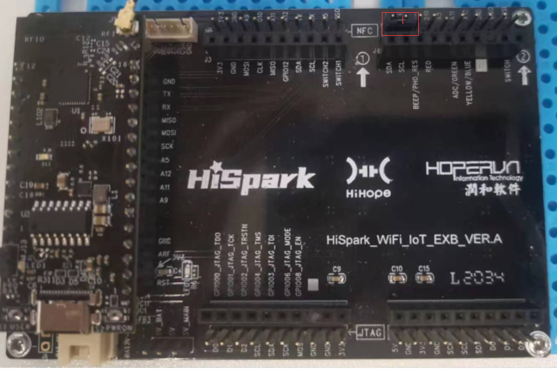
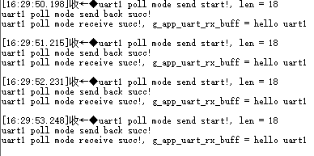
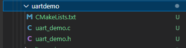
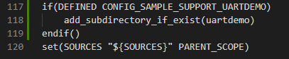
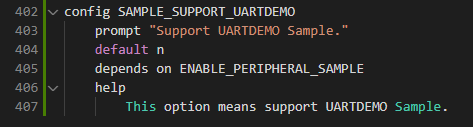
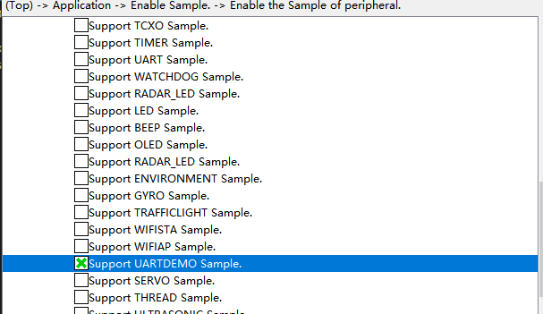

## uartdemo

## 1.1 介绍

**功能介绍：** 本实验GPIO 15,GPIO 16复用为UART功能，板端TX与RX通过跳线帽连接，实现轮询方式数据的发送与接收和中断方式数据接收与发送。

**软件概述：** GPIO引脚输出高低电平状态。

**硬件概述：** 核心板、底板。核心板主板插在底板上，查看底板左侧，通过查看主板丝印核心板TXD1对应底板TX，在底板右侧寻找TX硬件接口，使用杜邦线（跳线帽）将TX与RX相连，核心板主板插在底板上，查看底板左侧，通过查看主板丝印核心板RXD1对应底板RX，在底板右侧寻找RX硬件接口，使用杜邦线（跳线帽）将TX与RX相连。一般情况下两块UART设备（A和B）通信，硬件接线方式为A板TX接B板RX，A板RX接B板TX，这里由于硬件数量有限，使用一块单板验证，单板的TX与RX通过杜邦线或者跳线帽相连。硬件搭建要求如图所示：

参考[核心板原理图](../../../../docs/hardware/HiHope_NearLink_DK_WS63E_V03/HIHOPE_NEARLINK_DK_3863E_V03.pdf)、[底板原理图](../../../../docs/hardware/HiHope_NearLink_DK_WS63E_V03/HiSpark_WiFi_IoT_EXB_VER.A.pdf)

## 1.2 约束与限制

### 1.2.1 支持应用运行的芯片和开发板

本示例支持开发板：HiHope_NearLink_DK3863E_V03

### 1.2.2 支持API版本、SDK版本

本示例支持版本号：1.10.101

### 1.2.3 支持IDE版本、支持配套工具版本

本示例支持IDE版本号：1.0.0.6；

## 1.3 效果预览

每隔5S串口循环打印“hello uart1”。

## 1.4 接口说明

### 1.4.1 uapi_pin_set_mode()

| **定义：**   | errcode_t uapi_pin_set_mode(pin_t pin, pin_mode_t mode); |
| ------------ | -------------------------------------------------------- |
| **功能：**   | 设置引脚复用模式                                         |
| **参数：**   | pin：io mode：复用模式                               |
| **返回值：** | ERRCODE_SUCC：成功    Other：失败                        |
| **依赖：**   | include\driver\pinctrl.h                                 |

### 1.4.2 uapi_uart_init()

| **定义：**   | errcode_t uapi_uart_init(uart_bus_t bus,  const uart_pin_config_t  *pins, const uart_attr_t  *attr,   const uart_extra_attr_t       *extra_attr, uart_buffer_config_t *uart_buffer_config); |
| ------------ | ------------------------------------------------------------------------------------------------------------------------------------------------------------------------------------------- |
| **功能：**   | 初始化指定的串口                                                                                                                                                                            |
| **参数：**   | bus：串口号 pins：UART中使用的PIN，包括TX, RX, RTS和CTS attr：UART的基础配置参数 extra_attr ：UART的高级配置参数 uart_buffer_config：指定UART的接收Buffer                   |
| **返回值：** | ERRCODE_SUCC：成功    Other：失败                                                                                                                                                           |
| **依赖：**   | include\driver\uart.h                                                                                                                                                                       |

### 1.4.3 uapi_uart_deinit()

| **定义：**   | errcode_t uapi_uart_deinit(uart_bus_t bus); |
| ------------ | ------------------------------------------- |
| **功能：**   | 去初始化指定的串口                          |
| **参数：**   | bus：串口号                                 |
| **返回值：** | ERRCODE_SUCC：成功    Other：失败           |
| **依赖：**   | include\driver\uart.h                       |

### 1.4.4 uapi_uart_write()

| **定义：**   | int32_t uapi_uart_write(uart_bus_t bus, const uint8_t *buffer, uint32_t length, uint32_t timeout);       |
| ------------ | -------------------------------------------------------------------------------------------------------- |
| **功能：**   | 将数据发送到已经打开的UART上，使用直接发送的方式                                                         |
| **参数：**   | bus：串口号 buffer： 要发送的数据Buffer   length：要发送的数据Buffer长度   timeout：超时时间 |
| **返回值：** | ERRCODE_SUCC：成功    Other：失败                                                                        |
| **依赖：**   | iinclude\driver\uart.h                                                                                   |

### 1.4.5 uapi_uart_write_int()

| **定义：**   | errcode_t uapi_uart_write_int(uart_bus_t bus, const uint8_t *buffer, uint32_t length,void *params, uart_tx_callback_t finished_with_buffer_func);                                   |
| ------------ | ----------------------------------------------------------------------------------------------------------------------------------------------------------------------------------- |
| **功能：**   | 使用中断模式将数据发送到已经打开的UART上，当数据发送完成，会调用回调函数                                                                                                            |
| **参数：**   | bus：串口号 buffer： 要发送的数据Buffer   length：要发送的数据Buffer长度   params：传递到完成传输的回调函数的参数 finished_with_buffer_func：数据发送完成的回调函数 |
| **返回值：** | ERRCODE_SUCC：成功    Other：失败                                                                                                                                                   |
| **依赖：**   | include\driver\uart.h                                                                                                                                                               |

### 1.4.6 uapi_uart_read()

| **定义：**   | int32_t uapi_uart_read(uart_bus_t bus, const uint8_t *buffer, uint32_t length, uint32_t timeout);          |
| ------------ | ---------------------------------------------------------------------------------------------------------- |
| **功能：**   | 从UART读取数据                                                                                             |
| **参数：**   | bus：串口号 buffer： 存储接收数据的Buffer   length：存储接收数据Buffer长度   timeout：超时时间 |
| **返回值：** | ERRCODE_SUCC：成功    Other：失败                                                                          |
| **依赖：**   | include\driver\uart.h                                                                                      |

### 1.4.7 uapi_uart_register_rx_callback()

| **定义：**   | errcode_t uapi_uart_register_rx_callback(uart_bus_t bus, uart_rx_condition_t condition, uint32_t size, uart_rx_callback_t callback);             |
| ------------ | ------------------------------------------------------------------------------------------------------------------------------------------------ |
| **功能：**   | 注册接收回调函数，这个回调函数会根据触发条件和Size触发。                                                                                         |
| **参数：**   | bus：串口号 condition：回调触发的条件   size：如果触发条件涉及到数据长度，这个参数就表示需要的数据长度  callback：接收数据的回调函数 |
| **返回值：** | ERRCODE_SUCC：成功    Other：失败                                                                                                                |
| **依赖：**   | include\driver\uart.h                                                                                                                            |

## 1.5 具体实现

步骤一：设置GPIO复用uart功能。

步骤二：配置uart参数，例如波特率、数据位、停止位、校验位等。

步骤三：初始化uart设备。

步骤四：通过uapi_uart_write函数写数据。

步骤五：通过uapi_uart_read函数读数据。

## 1.6 实验流程

- 步骤一：在xxx\src\application\samples\peripheral文件夹新建一个sample文件夹，在peripheral上右键选择“新建文件夹”，创建Sample文件夹，例如名称”uartdemo“。

  
- 步骤二：将xxx\vendor\HiHope_NearLink_DK_WS63E_V03\uartdemo文件里面内容拷贝到**步骤一创建的Sample文件夹中”uartdemo“**。

  
- 步骤三：在xxx\src\application\samples\peripheral\CMakeLists.txt文件中新增编译案例，具体如下图所示（如果不知道在哪个地方加的，可以在“set(SOURCES "${SOURCES}" PARENT_SCOPE)”上面一行添加）。

  
- 步骤四：在xxx\src\application\samples\peripheral\Kconfig文件中新增编译案例，具体如下图所示（如果不知道在哪个地方加，可以在最后一行添加）。

  
- 步骤五：点击如下图标，选择KConfig，具体选择路径“Application/Enable the Sample of peripheral”，在弹出框中选择“support UARTDEMO Sample”，点击Save，关闭弹窗。

  
- 步骤六：点击“build”或者“rebuild”编译

  
- 步骤七：编译完成如下图所示。

  
- 步骤八：在HiSpark Studio工具中点击“工程配置”按钮，选择“程序加载”，传输方式选择“serial”，端口选择“comxxx”，com口在设备管理器中查看（如果找不到com口，请参考windows环境搭建）。

  
- 步骤九：配置完成后，点击工具“程序加载”按钮烧录。

  
- 步骤十：出现“Connecting, please reset device...”字样时，复位开发板，等待烧录结束。

  
- 步骤十一：软件烧录成功后，按一下开发板的RESET按键复位开发板，烧录完成后，每隔5S串口循环打印“hello uart1”。

  
