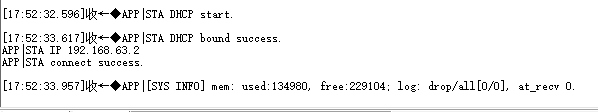
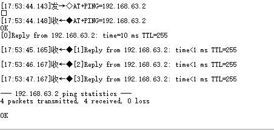
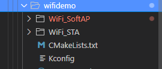
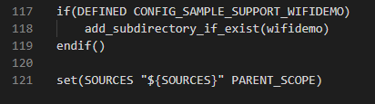
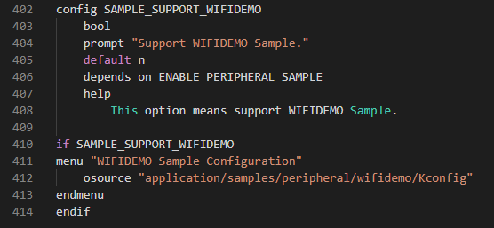
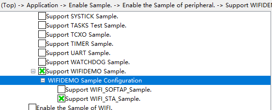

# Wi-Fi TCP/UDP测速

## 1.1 介绍

**功能介绍：** 实现两块开发板，一块设置STA模式，一块设置为AP模式，通过AT+PING指令PING。

**硬件概述：** 核心板。硬件搭建要求如图所示：

## 1.2 约束与限制

### 1.2.1 支持应用运行的芯片和开发板

本示例支持开发板：HiHope_NearLink_DK3863E_V03

### 1.2.2 支持API版本、SDK版本

本示例支持版本号：1.10.101

### 1.2.3 支持IDE版本、支持配套工具版本

本示例支持IDE版本号：1.0.0.6；

## 1.3 效果预览

两块板子连接后，可以看到STA IP地址：192.168.63.2，AP IP地址：192.168.63.1，AP端板子在串口使用AT+PING=“STA端IP地址”。

STA端：

AP端：

## 1.4 接口介绍

### 1.4.1 wifi_sta_enable()

| **定义：**   | errcode_t wifi_sta_enable(void);                |
| ------------ | ----------------------------------------------- |
| **功能：**   | 开启SoftAP                                      |
| **参数：**   | config：SoftAp的配置                            |
| **返回值：** | ERROCODE_SUCC：成功    Other：失败              |
| **依赖：**   | include\middleware\services\wifi\wifi_hotspot.h |

### 1.4.2 netifapi_netif_set_addr()

| **定义：**   | err_t netifapi_netif_set_addr(struct netif *netif, const ip4_addr_t *ipaddr, const ip4_addr_t *netmask, const ip4_addr_t *gw); |
| ------------ | ------------------------------------------------------------------------------------------------------------------------------ |
| **功能：**   | 设置网络接口的IP地址                                                                                                           |
| **返回值：** | ERROCODE_SUCC：成功    Other：失败                                                                                             |
| **依赖：**   | open_source\lwip\lwip_v2.1.3\src\include\lwip\netifapi.h                                                                       |

### 1.4.3 netifapi_dhcps_start()

| **定义：**   | err_t netifapi_dhcps_start(struct netif *netif, char *start_ip, u16_t ip_num); |
| ------------ | ------------------------------------------------------------------------------ |
| **功能：**   | 启动dhcp服务                                                                   |
| **返回值：** | ERROCODE_SUCC：成功    Other：失败                                             |
| **依赖：**   | open_source\lwip\lwip_v2.1.3\src\include\lwip\netifapi.h                       |

### 1.4.4 wifi_sta_scan()

| **定义：**   | errcode_t wifi_sta_scan(void);                 |
| ------------ | ---------------------------------------------- |
| **功能：**   | 进行全信道基础扫描                             |
| **参数：**   | void类型                                       |
| **返回值：** | ERRCODE_SUCC：成功   Other：失败               |
| **依赖：**   | include\middleware\services\wifi\wifi_device.h |

### 1.4.5 wifi_sta_connect()

| **定义：**   | errcode_t wifi_sta_connect(const wifi_sta_config_stru *config); |
| ------------ | --------------------------------------------------------------- |
| **功能：**   | 进行连接网络                                                    |
| **参数：**   | config：连接的网络参数                                          |
| **返回值：** | ERRCODE_SUCC：成功   Other：失败                                |
| **依赖：**   | include\middleware\services\wifi\wifi_device.h                  |

### 1.4.6 wifi_sta_get_ap_info()

| **定义：**   | errcode_t wifi_sta_get_ap_info(wifi_linked_info_stru *result); |
| ------------ | -------------------------------------------------------------- |
| **功能：**   | 获取station连接的网络状态                                      |
| **参数：**   | result：连接状态                                               |
| **返回值：** | ERRCODE_SUCC：成功   Other：失败                               |
| **依赖：**   | include\middleware\services\radar\radar_service.h              |

## 1.5 具体实现

步骤一：初始化wifi。

步骤二：启动STA扫描，获取等待连接的网络。

步骤三：DHCP获取IP地址，并PING主机。

## 1.6 实验流程

- 步骤一：在xxx\src\application\samples\peripheral文件夹新建一个sample文件夹，在peripheral上右键选择“新建文件夹”，创建Sample文件夹，例如名称”wifista“。

  
  
- 步骤二：将xxx\vendor\HiHope_NearLink_DK_WS63E_V03\wifidemo文件里面内容拷贝到**步骤一创建的Sample文件夹中”wifidemo“**下。

  
  
- 步骤三：在xxx\src\application\samples\peripheral\CMakeLists.txt文件中新增编译案例，具体如下图所示（如果不知道在哪个地方加的，可以在“set(SOURCES "${SOURCES}" PARENT_SCOPE)”上面一行添加）。

  
  
- 步骤四：在xxx\src\application\samples\peripheral\Kconfig文件中新增编译案例，具体如下图所示（如果不知道在哪个地方加，可以在最后一行添加）。

  
  
- 步骤五：点击如下图标，选择KConfig，具体选择路径“Application/Enable Sample ”，如果选择编译STA端，在弹出框中选择“support  WiFi_STA”，点击Save，关闭弹窗；如果选择编译AP端，在弹出框中选择“support WiFi_SoftAP”，点击Save，，关闭弹窗。（需要准备两块开发板，选择不同的编译选项，烧录不同的镜像）

  
  
- 步骤六：点击“build”或者“rebuild”编译

  
  
- 步骤七：编译完成如下图所示。

  
  
- 步骤八：在HiSpark Studio工具中点击“工程配置”按钮，选择“程序加载”，传输方式选择“serial”，端口选择“comxxx”，com口在设备管理器中查看（如果找不到com口，请参考windows环境搭建）。

  
  
- 步骤九：配置完成后，点击工具“程序加载”按钮烧录。

  
  
- 步骤十：出现“Connecting, please reset device...”字样时，复位开发板，等待烧录结束。

  
  
- 步骤十一：两块板子连接后，可以看到STA IP地址：192.168.63.2，AP IP地址：192.168.63.1，AP端板子在串口使用AT+PING=“STA端IP地址”。

  STA端：
  
  
  
  AP端：
  
  
